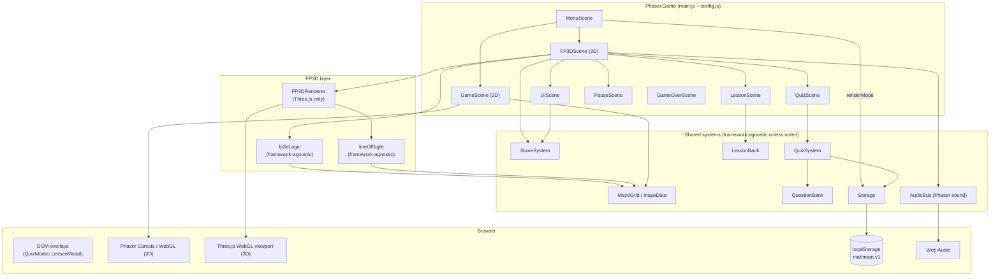
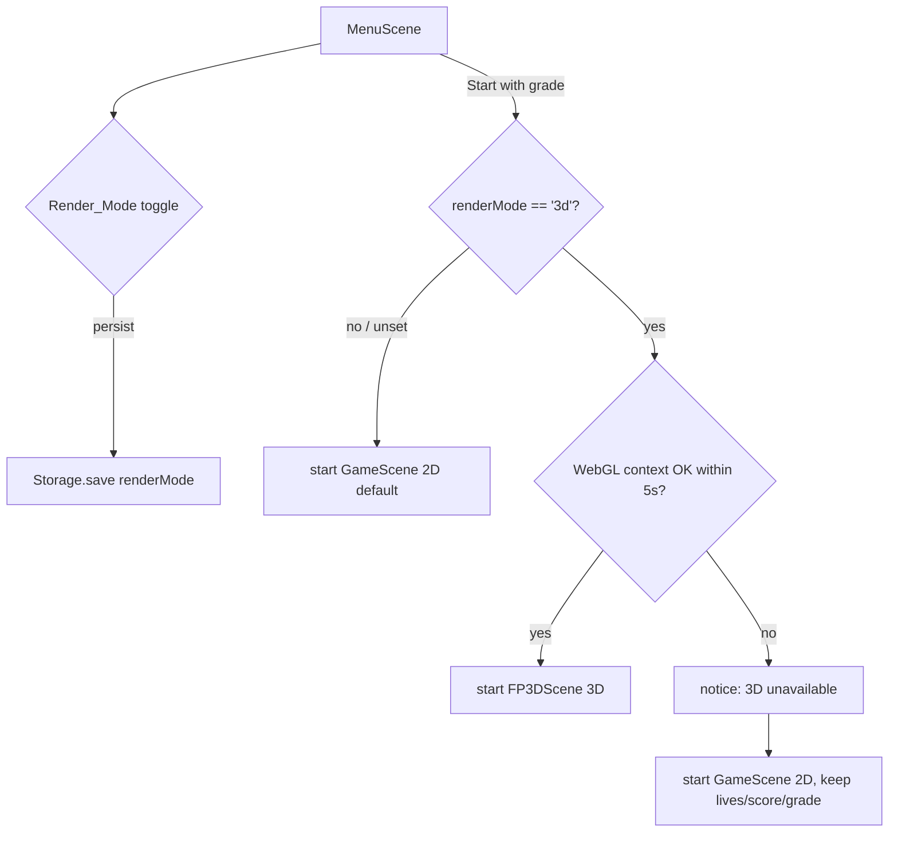
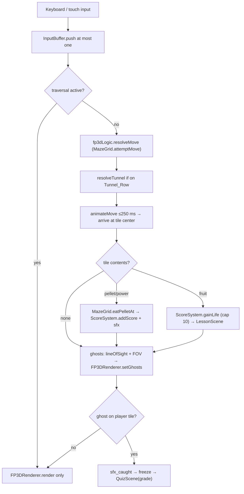
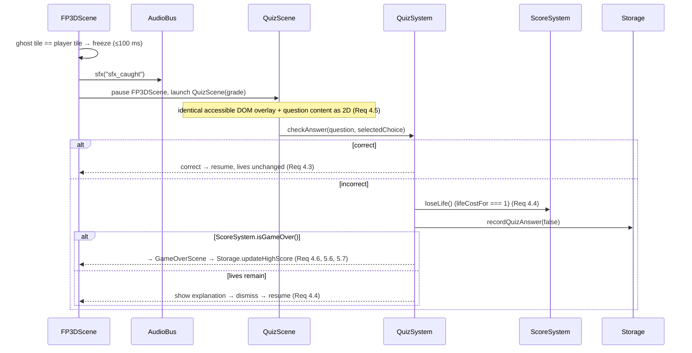

# Design Document

## Overview

The **first-person 3D mode** (FP3D_Mode) renders the *existing* Math Man maze from a camera positioned inside it, while reusing every framework-agnostic system the 2D game already ships. It is a **rendering + input layer**, not a new game: the same `MazeGrid`, `ScoreSystem`, `QuizSystem`, `QuestionBank`, `LessonBank`, and `Storage` drive both modes. Where the 2D `GameScene` calls a system method, FP3D_Mode calls the identical method — it never forks the logic (Req 9.1).

Phaser 3 remains the host. Phaser owns scene flow, the accessible DOM overlays (quiz / lesson / pause), audio (`AudioBus`), and 2D rendering. **Three.js** owns only the 3D viewport, isolated behind a renderer interface so no other module imports Three.js. The two coexist inside one `Phaser.Game`: `FP3DScene` is a Phaser scene that drives a per-frame render loop against a `FP3DRenderer` that manages the Three.js `WebGLRenderer`, `Scene`, and `PerspectiveCamera`.

The active presentation is a **Render_Mode** (`'2d' | '3d'`) chosen from the menu and persisted through the existing `Storage` (`mathman.v1`), defaulting to `'2d'` (Req 6.1, 6.3, 6.5, 6.6).

### Goals

- Render the exact `getLevelLayout()` maze (28×31, `TILE_SIZE = 24`) in first person, byte-for-byte faithful to the tile-code layout (Req 1.1, 1.5).
- Grid-locked cardinal movement and cardinal-only facing, interpolated ≤250 ms per tile (Req 2.2, 2.4).
- Preserve the educational loop: ghost-on-tile capture opens the same quiz; fruit grants a life plus a micro-lesson (Req 4, 5.2).
- Reuse scoring, lives (start 6, cap 10), difficulty-by-grade, and `mathman.v1` persistence unchanged (Req 5).
- Occlusion-correct ghost visibility computed with a pure grid line-of-sight test (Req 3.7, 3.8).
- Graceful fallback to 2D when WebGL is unavailable, with the maze data left intact (Req 1.6, 8.1, 8.5).
- Mandatory property-based tests for all new framework-agnostic logic (Req 10).

### Non-Goals

- No new maze, no second source of truth for tiles — FP3D reads only `getLevelLayout()` via `MazeGrid` (Req 1.5).
- No change to observable 2D behavior (Req 9.3).
- No additional runtime dependency beyond Three.js (Req 9.2).
- Pointer-lock / mouse-look is optional; full play must be possible with discrete keyboard controls (Req 7.3).

## Technology Stack

| Concern | Choice | Rationale |
|---------|--------|-----------|
| 3D rendering + camera | **Three.js `0.186.0`** (pinned exact) | De-facto standard for first-person web games; recommended by the project's own `3d-web-games` reference; installs cleanly into the existing Vite 8.3.0 build (Req 9.2). |
| Host engine / scene flow | Phaser 3 (`3.90.0`, existing) | Owns scenes, DOM overlays, audio, 2D. FP3DScene is one more Phaser scene. |
| Bundler / dev server | Vite (`8.3.0`, existing) | 3D code tree-shakes and ships in the same static build (Req 9.4). |
| Wall batch rendering | Three.js `InstancedMesh` | All wall boxes in one draw call — the key perf win on a 28×31 grid. |
| Maze / movement / LOS logic | Framework-agnostic ES modules | `MazeGrid` (existing) + new `fp3dLogic` / `lineOfSight`; import neither Phaser nor Three.js (Req 9.1). |
| Accessible modals | DOM overlays (existing) | Identical quiz/lesson overlays as 2D (Req 4.5, 7.1, 7.2). |
| Persistence | `localStorage` + in-memory fallback (existing `Storage`) | Adds a `renderMode` record under `mathman.v1` (Req 6.5, 8.4). |
| Tests | Vitest + `fast-check` (existing) | Property-based tests are mandatory for new pure logic (`.kiro/steering/testing.md`, Req 10). |

**Dependency policy (Req 9.2):** add exactly `"three": "0.186.0"` to `package.json` `dependencies` — pinned, no range or wildcard — alongside the existing pinned `phaser 3.90.0`, `vite 8.3.0`, `vitest 4.1.11`, and `fast-check 4.10.2`. No other new runtime dependency.

## Architecture

Phaser hosts both render modes. `MenuScene` chooses the Render_Mode; starting a game launches either the existing 2D `GameScene` or the new `FP3DScene`. Both scenes talk to the **same** framework-agnostic systems and the **same** DOM overlays. Only `FP3DScene` touches `FP3DRenderer`, and only `FP3DRenderer` imports Three.js.



The dashed rule the diagram encodes: arrows into `Maze`, `Score`, `QSys`, `QBank`, `LBank`, and `Store` are the **same** ones `GameScene` uses. `FP3DRenderer` is the only box that may `import * as THREE`.

## Components and Interfaces

Four new files, split by dependency boundary:

- **`src/systems/fp3d/fp3dLogic.js`** — framework-agnostic (no Phaser, no Three.js). Owns the pure FP3D decisions: 3D coordinate mapping, grid-locked movement resolution, cardinal facing, at-most-one input buffering, and tunnel-wrap resolution. Delegates maze questions to a `MazeGrid` instance.
- **`src/systems/fp3d/lineOfSight.js`** — framework-agnostic. A pure grid line-of-sight walk over a `MazeGrid` used for occlusion-correct ghost visibility.
- **`src/scenes/FP3DScene.js`** — Phaser scene. Owns the render loop, input wiring, overlay launches, and the freeze-while-overlay-open rule. Delegates all drawing to `FP3DRenderer`.
- **`src/render/FP3DRenderer.js`** — Three.js-facing, isolated. Owns `WebGLRenderer`, `Scene`, `PerspectiveCamera`; builds walls/floor/markers/ghosts; positions the camera; disposes GPU resources on teardown.

### `fp3dLogic` (framework-agnostic)

Cardinal directions map onto the existing `DIRECTIONS` deltas in `mazeLogic.js` (`north→up`, `south→down`, `west→left`, `east→right`), so no maze knowledge is duplicated.

```js
export const CARDINALS = ['north', 'east', 'south', 'west']; // clockwise
export const CARDINAL_TO_DIR = { north: 'up', south: 'down', west: 'left', east: 'right' };

// 3D coordinate mapping. World is X (east), Z (south), Y up. Reuses tile size.
tileToWorld3D(grid, col, row)      // -> { x, z } floor-center for a tile
worldToTile3D(grid, x, z)          // -> { col, row } inverse (Property 1)
eyePosition(grid, col, row, eyeHeight) // -> { x, y, z } camera anchor (Req 2.1)

// Facing (Property 3): each returns exactly one CARDINALS member.
turnLeft(facing)                   // counter-clockwise
turnRight(facing)                  // clockwise
setFacing(facing)                  // validated pass-through / default 'north'

// Grid-locked movement resolution (Property 2), reusing MazeGrid.attemptMove.
resolveMove(grid, col, row, facing)
// -> { col, row, moved: boolean } — unchanged col/row when target is a wall (Req 2.3)

// Tunnel wrap resolution (Property 4), reusing MazeGrid tunnel logic.
resolveTunnel(grid, col, row, facing)
// -> { col, row, facing } — same row, opposite in-bounds edge, facing preserved (Req 2.5)

// At-most-one input buffering (Property 5).
class InputBuffer {
  push(intent)   // stores at most one pending intent; extra pushes are dropped (Req 2.7)
  take()         // returns + clears the single buffered intent, or null
  get size()     // 0 or 1, always
}

// Ghost advancement (Req 9.1): a thin per-tick wrapper around the EXISTING,
// already framework-agnostic `src/entities/ghostAI.js` exports
// (`chooseGhostDirection`, `computeTargetTile`, `ghostSpeedForGrade`) — no
// ghost decision logic is forked. `advanceGhosts` is the seam `FP3DScene`
// calls each tick instead of inlining personality/target-tile logic itself.
advanceGhosts(grid, ghosts, playerTile, grade)
// -> ghosts.map(g => ({ ...g, col, row })) — one resolved step per ghost,
//    computed via ghostAI.chooseGhostDirection(grid, g, playerTile) using
//    g.personality (see FP3D ghost state below); never reverses, never
//    enters a wall (Property 23, reused — not re-proven here).
```

`resolveMove` wraps `MazeGrid.attemptMove(col, row, CARDINAL_TO_DIR[facing])` and returns its `{ col, row, moved }` result verbatim, so wall behavior is exactly the 2D behavior. `resolveTunnel` uses the same `tunnelRows` / `cols` data `MazeGrid.wrapIfTunnel` relies on, resolved in tile space.

### `lineOfSight` (framework-agnostic)

```js
// True when NO wall tile lies on the straight grid segment between the two
// tiles (endpoints excluded). Pure supercover/Bresenham walk over MazeGrid,
// checking WALL_CODES via grid.isWall. Symmetric in its tile arguments.
hasLineOfSight(grid, fromCol, fromRow, toCol, toRow) // -> boolean (Req 3.7, 3.8)

// Convenience: LOS AND within-FOV test used by the renderer for a ghost.
isGhostVisible(grid, player, facing, ghost, fovDegrees) // -> boolean
```

`hasLineOfSight` is the gameplay visibility rule (Property 6). Three.js raycasting is **not** used for it — raycasting is reserved for cosmetic effects only (skill §4).

### `FP3DScene` (Phaser)

Mirrors `GameScene`'s responsibilities in 3D:

```js
create()      // build MazeGrid from getLevelLayout(); construct FP3DRenderer;
              //   place player/ghosts/fruit at spawn tiles (Req 1.4); wire input.
update(t, dt) // if frozen -> render only; else step movement interpolation,
              //   advance ghosts (reuse ghostAI), collect pellets/fruit,
              //   test capture, then FP3DRenderer.render(state).
```

- **Overlay launches** are identical to `GameScene`: on capture it `sfx('sfx_caught')`, pauses movement, and launches `QuizScene(grade)`; fruit launches `LessonScene`; `P`/`Esc` launches `PauseScene`. While any overlay is open the scene is **frozen** — movement/turn input ignored and ghost activity suspended (Req 4.2, 6.7).
- **Exit control:** an on-screen/keyboard control ends the game and returns to `MenuScene` within 1 s (Req 6.4).
- **Fallback:** if `FP3DRenderer` reports no WebGL context (or context loss), `FP3DScene` stops, restores the `renderMode='2d'` intent, shows a visible notice, and starts `GameScene` preserving lives/score/grade (Req 1.6, 8.1, 8.5).

### `FP3DRenderer` (Three.js only)

```js
constructor(canvasOrParent, { grid, colors, eyeHeight, dprCap, reducedMotion })
// -> may throw NoWebGLContextError; caller falls back to 2D. Also attaches a
//    `webglcontextlost` listener on the created canvas (Req 8.1, 8.5) that
//    invokes the injected `onContextLost` callback so a MID-SESSION loss (not
//    just a failed initial `getContext`) triggers the same 2D fallback path in
//    `FP3DScene` — construction-time failure and later context loss are
//    different browser events and both must reach the fallback.

buildMaze(grid)        // InstancedMesh of wall boxes (one draw call, Req 1.2);
                       //   floor plane over traversable tiles (Req 1.3).
setCamera(col, row, facing) // camera at eyePosition, yaw snapped to a cardinal (Req 2.1, 2.4).
animateTurn(from, to)  // discrete turn; instant snap when reducedMotion (Req 7.4).
animateMove(from, to, ms)   // interpolate ≤250 ms; snap when reducedMotion (Req 2.2).
setReducedMotion(enabled)   // live toggle (Req 7.4 allows enabling mid-session,
                       //   not just at construction); affects subsequent
                       //   animateTurn/animateMove calls immediately.
setPelletVisible(col, row, visible)   // markers (Req 3.1); powerPellet differs visibly (Req 3.2).
setFruit(col, row, present)           // fruit marker at spawn (Req 3.5).
setGhosts(ghostStates, visibilityFn)  // 4 distinct GHOST_COLORS; hidden per LOS/FOV (Req 3.6–3.8).
render(state)          // one frame.
dispose()              // dispose geometries/materials/renderer; also removes the
                       //   `webglcontextlost` listener (perf §5).
```

Renderer construction sets `renderer.setPixelRatio(Math.min(devicePixelRatio, dprCap))` with `dprCap = 2`, `antialias: true`, `powerPreference: 'high-performance'`, and a tight far plane. Missing 3D asset → a drawn placeholder mesh substitutes (Req 8.2). Ghost visibility is decided by the injected `visibilityFn` (backed by `lineOfSight`), never by raycasting.

## Data Models

FP3D introduces no new persisted *maze* data; it adds one Render_Mode record and a small in-memory FP3D state object.

**Render_Mode (persisted, extends `mathman.v1`):**

```js
// Added to the existing Storage state shape.
renderMode: '2d' | '3d'   // default '2d' (Req 6.3, 6.6)
```

`Storage.save({ renderMode })` / `Storage.get().renderMode` persist and read it, degrading to in-memory on failure exactly like every other record (Req 6.5, 8.4). `Storage.normalize` coerces any invalid value back to `'2d'`.

**FP3D runtime state (in-memory, owned by `FP3DScene`):**

```js
{
  player: { col, row, facing },        // facing ∈ CARDINALS
  traversal: { active, from, to, ms } | null, // in-progress tile move
  buffer: InputBuffer,                 // 0 or 1 pending intent
  ghosts: [{ key, color, personality, col, row }], // 4 entries; colors from
                                        // GHOST_COLORS, personality from
                                        // GHOST_PERSONALITIES (config.js) —
                                        // `personality` is REQUIRED here because
                                        // `ghostAI.computeTargetTile`/
                                        // `chooseGhostDirection` branch on it;
                                        // omitting it would silently default
                                        // every ghost to the same target-tile
                                        // rule when `advanceGhosts` calls them.
  fruit: { col, row, present },
  frozen: boolean,                     // true while an overlay is open
  reducedMotion: boolean,
}
```

**Coordinate mapping:** tile `(col, row)` → world `{ x: col*TILE_SIZE + TILE_SIZE/2, z: row*TILE_SIZE + TILE_SIZE/2 }`, `y = 0` floor. `worldToTile3D` floors each axis by `TILE_SIZE`, matching the existing `worldToTile` convention so the round-trip holds for every tile center (Property 1).

**Reused shapes (unchanged):** the maze tile codes (`#`/`.`/`o`/`M`/`G`/`F`/`-`), the question record (`{ id, grade, subject, topic, difficulty, question, choices[], answer, explanation }` — answers match by value), and the `mathman.v1` state (`{ highScore, lastDifficulty, audioMuted, quizStats, renderMode }`).

## Project Structure

New and touched files (everything else is unchanged):

```
package.json                 # + "three": "0.186.0" (exact) under dependencies
src/
  main.js                    # register FP3DScene in the scene list
  config.js                  # + FP3D constants (see below)
  scenes/
    FP3DScene.js             # NEW — Phaser scene: render loop, overlays, freeze, fallback
    MenuScene.js             # 2D/3D Render_Mode toggle (persist via Storage)
  render/
    FP3DRenderer.js          # NEW — Three.js only: WebGLRenderer/Scene/Camera, InstancedMesh
  systems/
    fp3d/
      fp3dLogic.js           # NEW — framework-agnostic: coords, movement, facing, buffer, tunnel
      fp3dLogic.test.js      # NEW — fast-check properties 1–5, 7
      lineOfSight.js         # NEW — framework-agnostic: pure grid line-of-sight walk
      lineOfSight.test.js    # NEW — fast-check property 6
```

`fp3dLogic.js` and `lineOfSight.js` import neither Phaser nor Three.js — only `mazeData.js`/`mazeLogic.js` and `config.js` (Req 9.1). `FP3DRenderer.js` is the sole Three.js importer.

**New `config.js` constants** (no hardcoded numbers in scene/renderer):

```js
export const FP3D = {
  eyeHeight: TILE_SIZE * 0.5,   // camera anchor height at tile center (Req 2.1)
  dprCap: 2,                    // devicePixelRatio cap (perf §5)
  tileTraversalMs: 220,         // ≤250 ms per tile move (Req 2.2)
  turnAnimMs: 120,              // discrete cardinal turn; 0 when reduced-motion (Req 7.4)
  fovDegrees: 75,               // camera + visibility FOV
  webglTimeoutMs: 5000,         // context-creation budget before 2D fallback (Req 8.1)
  assetTimeoutMs: 10000,        // 3D asset load budget before placeholder (Req 8.2)
};
export const DEFAULT_RENDER_MODE = '2d'; // (Req 6.3, 6.6)
```

## Event Flow

### Mode selection and entry



### FP3D gameplay tick and capture



### Einstein quiz sequence (reuses the exact 2D path)



Focus management: when `QuizScene` opens over FP3D, focus moves to the first interactive control within 500 ms and is trapped inside the overlay until it closes (Req 7.7, 7.8) — the same overlay behavior as 2D.

## Error Handling

- **No WebGL / context lost (Req 1.6, 8.1, 8.5):** `FP3DRenderer` construction that cannot obtain a context (or a later `webglcontextlost` event) throws/emits; `FP3DScene` falls back to `GameScene` (2D), shows a visible "3D unavailable" notice, sets `renderMode` intent to `'2d'`, and preserves lives, score, and grade. `Maze_Data` is never modified.
- **Missing 3D asset (Req 8.2):** a texture/model that fails to load within `assetTimeoutMs` is replaced by a drawn placeholder mesh; play continues.
- **Missing audio (Req 8.3):** routed through the existing `AudioBus`, so an absent sound key is a silent no-op.
- **Blocked / absent `localStorage` (Req 8.4, 6.5):** the existing `Storage` degrades to in-memory records for the session, including the new `renderMode`.
- **Malformed maze data (Req 1.6):** `MazeGrid` construction calls `validateLayout`, which throws on a non-rectangular layout; `FP3DScene` catches it, switches to 2D with a notice, and leaves the layout untouched.
- **Reduced motion (Req 7.4, 7.5):** if `matchMedia('(prefers-reduced-motion: reduce)')` matches at start (or the user enables the setting), turn/move animations are shortened or snapped instantly while grid-locked position changes still occur.
- **Overlay open:** movement/turn input ignored and ghosts frozen (Req 4.2, 6.7); listener errors in `ScoreSystem` are already isolated by its emitter.

## Correctness Properties

*A property is a characteristic or behavior that should hold true across all valid executions of a system — essentially, a formal statement about what the system should do. Properties serve as the bridge between human-readable specifications and machine-verifiable correctness guarantees.*

These Core Properties cover the **framework-agnostic** FP3D logic (`fp3dLogic`, `lineOfSight`) plus the scoring/lives reuse. Purely visual, scene-flow, DOM/ARIA, WebGL-wiring, and timing criteria stay example-based/integration (see Testing Strategy) and are not forced into properties. Criteria already guaranteed by the existing math-man properties (Storage high-score/in-memory fallback, `QuizSystem`/`ScoreSystem` behavior) are reused rather than re-proven here.

### Property 1: Tile → world3D → tile round-trip

*For any* `MazeGrid` built from `getLevelLayout()` and *any* in-bounds tile — column in `[0, cols-1]` and row in `[0, rows-1]` — `worldToTile3D(grid, ...tileToWorld3D(grid, col, row))` returns a tile whose `col` and `row` equal the originals, and the grid's tile-code layout remains identical to `getLevelLayout()`.

**Validates: Requirements 10.1, 1.1**

### Property 2: Movement resolution respects walls

*For any* `MazeGrid`, *any* start tile, and *any* facing, when the target neighbor in that facing is not enterable (a wall or out of bounds on a non-tunnel row), `resolveMove` returns `{ moved: false }` with `col`/`row` equal to the start tile; when it is enterable, the returned tile equals that enterable neighbor.

**Validates: Requirements 10.2, 2.3**

### Property 3: Facing resolution yields exactly one cardinal

*For any* current facing in `CARDINALS` and *any* turn input (`turnLeft`, `turnRight`, or `setFacing`), the result is exactly one member of `{north, south, east, west}` — never zero and never more than one.

**Validates: Requirements 10.3, 2.4**

### Property 4: Tunnel-wrap resolution

*For any* `MazeGrid` and *any* player position on a Tunnel_Row that steps off a horizontal edge, `resolveTunnel` returns a tile whose row equals the entry row, whose column equals the opposite in-bounds edge column determined by the `MazeGrid` wrap logic, and whose facing equals the entry facing.

**Validates: Requirements 10.4, 2.5**

### Property 5: Input buffering keeps at most one

*For any* sequence of input intents pushed into an `InputBuffer` during a single traversal, `size` never exceeds 1 and `take()` returns the single retained intent (or null when none), with all excess intents discarded.

**Validates: Requirements 2.7**

### Property 6: Line-of-sight is wall-blocked and symmetric

*For any* `MazeGrid` and *any* two tiles, if at least one wall tile lies on the straight grid segment between them, then `hasLineOfSight` is false (the ghost is not visible); and for any two tiles `hasLineOfSight(grid, a, b)` equals `hasLineOfSight(grid, b, a)`.

**Validates: Requirements 3.7, 3.8**

### Property 7: Scoring and lives reuse matches the 2D rules

*For any* item type, the points awarded on collection equal the existing `POINTS` value for that type (`pellet`, `powerPellet`, `fruit`) via `MazeGrid.pointsFor` + `ScoreSystem.addScore`; and *for any* `ScoreSystem` run, lives start at 6, `gainLife` never raises lives above 10, `loseLife` never lowers them below 0, a correct answer costs 0 lives and a wrong answer costs exactly 1 (`lifeCostFor`).

**Validates: Requirements 5.1, 5.3, 5.4, 5.5**

## Testing Strategy

**Dual approach.** Property-based tests verify the universal behavior of the new pure logic; example-based and integration tests cover the Three.js renderer, Phaser scene flow, DOM overlays, and browser-environment fallbacks.

### Property-based tests (mandatory — Vitest + `fast-check`)

- Library: `fast-check` under Vitest (both already pinned dev dependencies). Property-based tests are required by `.kiro/steering/testing.md` — no from-scratch PBT.
- Each Core Property above maps to exactly **one** `fast-check` property test, at **≥100 generated cases** per property (Req 10.5).
- Each test is tagged with a comment referencing its property, e.g.
  `// Feature: first-person-3d-mode, Property 2: Movement resolution respects walls — Validates: Requirements 10.2, 2.3`.
- Location: `src/systems/fp3d/fp3dLogic.test.js` (Properties 1–5 and 7) and `src/systems/fp3d/lineOfSight.test.js` (Property 6).
- Generators build `MazeGrid` instances from `getLevelLayout()` and draw in-bounds tiles, cardinal facings, and input sequences; edge cases (out-of-bounds targets, tunnel rows, all-recent buffers) are produced by the generators rather than as separate tests.
- Run non-interactively with `npm run test -- --run` after any change to a framework-agnostic module; a missing or failing property test means the owning task is not complete and the failure surfaces via the runner's non-success exit code (Req 10.6).

### Example-based and integration tests

- **Renderer (`FP3DRenderer`):** example tests assert 4 distinct `GHOST_COLORS` (Req 3.6), DPR is capped at 2, and `dispose()` releases geometries/materials; instanced-wall build is smoke-checked against a small layout.
- **Scene flow (`FP3DScene`):** example tests for freeze-while-overlay-open (input ignored, ghosts suspended — Req 4.2, 6.7), capture → quiz launch, fruit → lesson launch, and exit-to-menu.
- **Fallbacks:** WebGL-unavailable → 2D with notice and preserved progress (Req 1.6, 8.1, 8.5); missing 3D asset → placeholder (Req 8.2); missing audio → silent no-op (Req 8.3); blocked storage → in-memory `renderMode` (Req 8.4).
- **Accessibility:** manual/integration checks for keyboard operability, roles/names, focus move within 500 ms, focus trap, reduced-motion, and mute (Req 7.1–7.8) — verified, but not via PBT.
- **Reused guarantees:** the existing math-man properties for `Storage` (high-score monotonic max; in-memory fallback), `QuizSystem` (answer check + life cost), and `ScoreSystem` continue to cover the shared paths FP3D routes through; FP3D adds no fork to re-prove.
- **Capture trigger (Req 4.1) is deliberately example-based, not a Core Property:** "a ghost occupies the player's tile" is a single tile-equality check with no independent branching logic to shrink on — it is exercised by the `FP3DScene` capture → quiz integration test (Testing Strategy, scene flow) rather than a `fast-check` property, so its absence from Properties 1–7 is an intentional scope decision, not a gap.
- **Build:** `npm run build` must succeed with FP3D included and the 2D build unchanged (Req 9.3, 9.4, 9.5). Do not run `npm run dev` in the agent shell.
