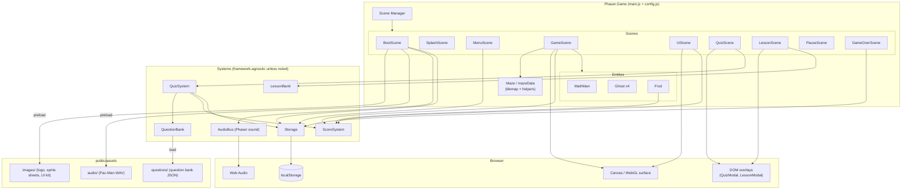
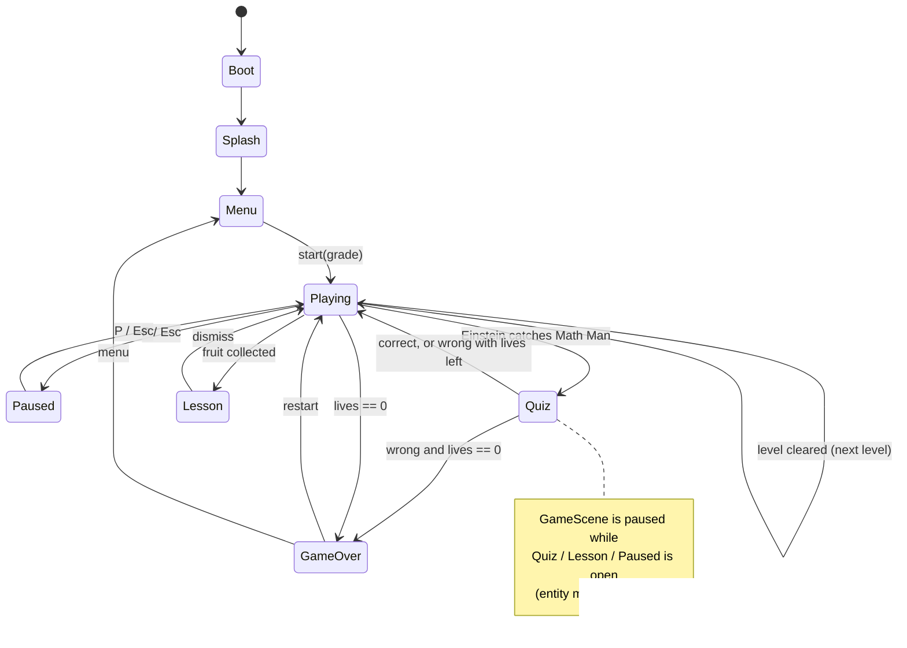
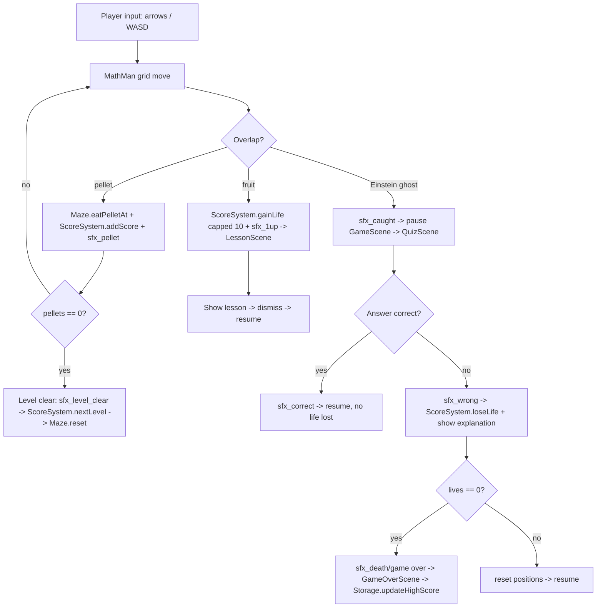
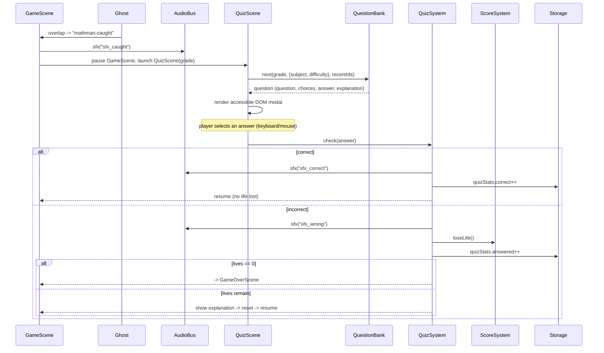
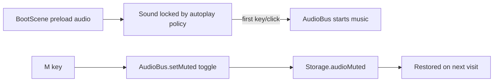

# Design Document

## Overview

Math Man is a client-side, single-page browser game built on **Phaser 3**, the open-source 2D HTML5 game framework. Phaser provides a WebGL renderer (with automatic Canvas fallback), a scene manager, arcade physics, tilemaps, input handling, and a Web Audio–based sound manager — all of which map directly onto this game's needs (maze rendering, state screens, collisions, and full music/SFX).

The project is bundled with **Vite** (fast dev server with hot-reload, and a static production build). The output is plain static files (HTML/JS/assets) that deploy to any static host — no backend. All persistence uses `localStorage` with an in-memory fallback.

Rendering, menus, and gameplay are handled by Phaser Scenes. Text-heavy, accessible UI (the quiz form and the lesson panel) is rendered as **DOM overlays** layered above the Phaser canvas, so questions and lessons stay crisp, keyboard-navigable, and screen-reader friendly.

### Goals

- Faithful Pac-Man-style maze gameplay with grid-locked movement, GPU-accelerated via Phaser/WebGL.
- Educational core: Einstein ghosts trigger grade-appropriate (5/6/7) math quizzes; fruits grant a life plus a micro-lesson.
- 6 starting lives, hard cap of 10.
- Colorful Einstein ghosts (red, pink, cyan, orange).
- Splash screen with the Math Man logo, then a start menu with grade selection.
- Arcade-style music and sound effects for all events.
- Single global high score, difficulty preference, mute, and quiz stats persisted locally.

### Non-Goals

- No accounts, login, or server-side storage.
- No multiplayer or networked features.
- No native/desktop packaging; browser only.

## Technology Stack

| Concern | Choice | Rationale |
|---------|--------|-----------|
| Rendering + game loop | Phaser 3 (`Phaser.AUTO`) | WebGL with Canvas fallback; batched sprite rendering; mature 2D engine. |
| Bundler / dev server | Vite | Fast HMR in dev; small static build for production. |
| Scenes / state flow | Phaser Scene Manager | Splash/menu/game/game-over as scenes; overlays via parallel scenes. |
| Physics / overlap | Phaser Arcade Physics | Lightweight AABB overlap checks for pellet/fruit/ghost contact. |
| Maze | Phaser Tilemap | Wall layer for collision; grid coordinates for movement. |
| Audio | Phaser Sound Manager (Web Audio) | Preloaded/decoded assets, loop + global mute built in. |
| Accessible modals | DOM overlays (HTML) | Keyboard-navigable, high-contrast quiz/lesson UI over the canvas. |
| Persistence | `localStorage` (+ in-memory fallback) | No login; resilient local records. |
| Tests | Vitest + `fast-check` | Runs against pure logic modules; property-based tests are mandatory (`.kiro/steering/testing.md`). |

Phaser is loaded as an npm dependency and pinned to an exact version in `package.json`.

## Architecture

High-level component view: the Phaser game owns the scenes; scenes read/write the framework-agnostic systems; systems talk to the browser (localStorage, Web Audio) and the DOM overlays sit above the canvas.



## Components and Interfaces

The runtime is organized into three layers, each detailed in the sections that follow:

- **Scenes** (`src/scenes/`) drive state flow — Boot, Splash, Menu, Game, UI, Quiz, Lesson, Pause, GameOver (see Scene Architecture).
- **Entities** (`src/entities/`) are Phaser sprites — MathMan, Ghost, Fruit (see Entities).
- **Systems** (`src/systems/`) are framework-agnostic logic — ScoreSystem, QuizSystem, QuestionBank, LessonBank, Storage, AudioBus (see Educational Systems, Score/Lives/Levels, Storage, and Audio System). Their public interfaces are given inline in those sections (e.g., the AudioBus API and Storage shape).

## Data Models

The core data shapes shared across modules (each detailed where it is introduced):

- **Maze tile codes** — `#` wall, `.` pellet, ` ` path, `o` power pellet, `M` Math Man spawn, `G` ghost spawn, `F` fruit spawn, `-` tunnel (see Maze Model).
- **Question record** — `{ id, grade, subject, topic, difficulty, question, choices[], answer, explanation }`; answers match by value, not index (see QuestionBank).
- **Persisted storage (`mathman.v1`)** — `{ highScore, lastDifficulty, audioMuted, quizStats: { answered, correct } }` (see Storage).

## Project Structure

```
index.html                 # Vite entry; hosts #game container + DOM overlay root
package.json               # phaser (pinned), vite, vitest + fast-check (mandatory PBT)
vite.config.js
public/
  assets/
    images/                # Math Man art (see Image Assets section) + ASSETS.md
      02_logo.png          #   logo (splash/menu)
      03_app_icon.png      #   favicon / PWA icon source
      04_mascot_sprite_sheet.png   # Math Man animation frames
      05_collectibles_and_math_icons.png  # pellets, fruit, life icons
      06_ui_kit.png        #   HUD, buttons, modal styling
      09_hero_einstein_enemies.png # title/menu hero
      ...                  #   posters/hero originals for marketing
    audio/                 # Pac-Man *.wav music + sfx (+ NOTICE.md; see Audio System)
    questions/
      math_man_question_bank_120.json  # 120 grade-tagged math/science questions
src/
  main.js                  # Phaser.Game config; registers scene list
  config.js                # Constants: tile size, speeds, LIVES_START=6, LIVES_MAX=10, colors, timings
  scenes/
    BootScene.js           # Preload all assets; init Storage/AudioBus; -> SplashScene
    SplashScene.js         # Math Man logo + intro; auto-advance or key/click -> MenuScene
    MenuScene.js           # Logo/title, Play button, grade selector, high score
    GameScene.js           # Maze, entities, gameplay update loop
    UIScene.js             # HUD overlay (score, lives, level, high score) run in parallel
    QuizScene.js           # Pauses GameScene; opens DOM quiz; resolves outcome
    LessonScene.js         # Pauses GameScene; opens DOM lesson; resumes
    PauseScene.js          # Pause overlay
    GameOverScene.js       # Final + high score; restart or menu
  entities/
    MathMan.js             # Player sprite (frames from 04_mascot_sprite_sheet.png): movement, animation
    Ghost.js               # Einstein ghost sprite: per-color frames, AI personality, movement
    Fruit.js               # Fruit sprite (from 05_collectibles_and_math_icons.png): spawn, collect
  maze/
    mazeData.js            # Tile layouts (per level)
    Maze.js                # Tilemap build + helpers: isWall, tile<->pixel, tunnel wrap, pellets
  systems/
    QuizSystem.js          # Orchestrates a quiz round; checks answers; updates stats
    QuestionBank.js        # Loads/validates question bank JSON; grade/subject filter; no-repeat
    LessonBank.js          # Math/science micro-lessons for fruit
    ScoreSystem.js         # Score, lives (6..10), level progression, game-over
    Storage.js             # localStorage wrapper w/ in-memory fallback
    AudioBus.js            # Event->sound mapping over Phaser sound; music crossfade; mute persist
  ui/
    QuizModal.js           # Builds/controls the DOM quiz form used by QuizScene
    LessonModal.js         # Builds/controls the DOM lesson panel used by LessonScene
```

`QuestionBank`, `LessonBank`, `ScoreSystem`, `Storage`, and the pure helpers in `Maze` are framework-agnostic (no Phaser imports) so they stay unit-testable and reusable.

## Image Assets

Art lives in `public/assets/images/` (catalogued in `ASSETS.md`). These PNGs were AI-generated for the project; they are loaded in `BootScene` and mapped to game elements as follows.

| File | Role in game | Loaded as |
|------|--------------|-----------|
| `02_logo.png` | Logo on SplashScene and MenuScene (Req 11.1, 11.2) | image |
| `03_app_icon.png` | Favicon / PWA icon (Req 11.5) | referenced from `index.html` / manifest |
| `04_mascot_sprite_sheet.png` | Math Man movement/pose frames (Req 13.1) | spritesheet / atlas |
| `05_collectibles_and_math_icons.png` | Pellets, fruit, life icons (Req 13.2) | spritesheet / atlas |
| `06_ui_kit.png` | HUD, buttons, modal styling cues (Req 13.3) | image / 9-slice where useful |
| `08_poster_einstein_enemies.png` | Ghost concept reference; marketing | image (menu/marketing) |
| `09_hero_einstein_enemies.png` | Title/menu hero background (Req 11.2) | image |
| `01_poster_original.png`, `07_hero_original.png` | Original concept/marketing art | not required at runtime |

Implementation notes:

- The mascot and collectibles sheets need frame definitions (either fixed-size `spritesheet` frames or a JSON `atlas`); the exact frame size/coordinates are established when wiring animations in the entity tasks.
- Source PNGs are high-resolution (~1.5-2 MB each); optimized/resized copies should be produced for runtime to keep load times reasonable (Req 11.3, 13.6).
- Every image load is guarded: on failure the game falls back to drawn shapes/text so it still boots and plays (Req 13.5; see Error Handling).

## Scene Architecture (replaces the manual state machine)

Phaser's Scene Manager provides the state flow. Overlay scenes are launched in parallel over a paused `GameScene` rather than tearing it down, so the frozen maze stays visible beneath them.

```
BootScene ──> SplashScene ──> MenuScene ──> GameScene (+ UIScene parallel)
                                 ^                │
                                 │                ├─ launch PauseScene   (pause GameScene) ── resume
                                 │                ├─ launch QuizScene     (pause GameScene)
                                 │                │     ├─ correct / wrong+lives ─> resume GameScene
                                 │                │     └─ wrong & lives==0 ─────> GameOverScene
                                 │                ├─ launch LessonScene   (pause GameScene) ── resume
                                 │                └─ level cleared ──────────────> next level (restart GameScene data)
                                 │
                            GameOverScene ── restart ─> GameScene
                            GameOverScene ── menu ────> MenuScene
```

The same flow as a state diagram:



| Scene | Runs GameScene? | Responsibility |
|-------|-----------------|----------------|
| BootScene | — | Preload assets, init Storage + AudioBus, then start Splash. |
| SplashScene | — | Show logo; auto-advance (~2s) or on key/click (Req 7.1, 7.2). |
| MenuScene | — | Logo/title, Play, grade selector (5/6/7), high score (Req 7.3, 10.1). |
| GameScene | active | Maze, Math Man, ghosts, fruit, gameplay `update()`. |
| UIScene | parallel | HUD: score, lives, level, high score (Req 1.6). |
| PauseScene | paused | Pause overlay; toggles back to GameScene (Req 7.5). |
| QuizScene | paused | Einstein-caught quiz via DOM modal (Req 3.3, 4.x). |
| LessonScene | paused | Fruit micro-lesson via DOM panel (Req 5.3, 5.4). |
| GameOverScene | stopped | Final + high score; restart or menu (Req 7.6). |

When `QuizScene`/`LessonScene`/`PauseScene` launch, they call `this.scene.pause('GameScene')`, which halts its `update()` — freezing all entity movement (satisfies Req 3.3, 4.6, 5.4). The frozen frame remains rendered underneath.

## Event Flow

Key runtime interactions between the scenes and systems. Each overlap/collision is detected in `GameScene.update()` and routed to the relevant system, with `AudioBus` firing the matching cue.

### Gameplay collisions and outcomes



### Einstein quiz sequence



### Audio unlock and mute



## Game Loop and Movement

Phaser drives the loop; `GameScene.update(time, delta)` runs each frame while active. There is no hand-written `requestAnimationFrame`.

Movement is **grid-locked** for authentic Pac-Man feel:

- Each mover (Math Man, ghosts) tracks a current `direction` and a `nextDirection` intent.
- An entity may only change direction when it is centered on a tile (within a small epsilon) and the target tile is not a wall — classic "turn buffering."
- Between tile centers, the sprite advances at a constant speed along `direction`; wall tiles block continued movement.
- Wall checks use the tilemap's collision layer (`Maze.isWall`). Pellet, fruit, and ghost contact use Arcade Physics `overlap` for cheap AABB checks.

## Maze Model

The maze is defined in `mazeData.js` as rows of tile codes and built into a Phaser Tilemap by `Maze.js`.

| Code | Meaning |
|------|---------|
| `#` | Wall (collision tile) |
| `.` | Pellet |
| ` ` | Empty path |
| `o` | Power pellet (reserved for optional future frightened mode) |
| `M` | Math Man spawn |
| `G` | Ghost house spawn |
| `F` | Fruit spawn point |
| `-` | Tunnel / horizontal wrap edge |

`Maze.js` exposes:

- `isWall(col, row)` — via the tilemap collision layer.
- `pelletCount()` / `eatPelletAt(col, row)` — pellets tracked as a sprite group; eating removes the sprite and returns points.
- `tileToWorld(col, row)` / `worldToTile(x, y)`.
- `wrapIfTunnel(entity)` — horizontal wrap-around at tunnel edges.
- `reset(level)` — rebuild pellet layer (and optionally swap layout) for the next level.

Pellets and fruit render as Phaser sprites/images in groups above the tile layer, using icons cut from `05_collectibles_and_math_icons.png` (Req 13.2); Math Man and ghosts render above pellets.

## Entities

Entities extend Phaser sprite/GameObject classes so they participate in the display list and physics.

### MathMan

- Fields: `direction`, `nextDirection`, `speed` (from `config.js`).
- `setDirection(dir)` queues `nextDirection`; applied when tile-centered and unobstructed.
- `preUpdate`/scene `update` advances along `direction`, calls `Maze.wrapIfTunnel`, and relies on Arcade overlap for pellet/fruit pickup.
- Animation: frames sliced from `04_mascot_sprite_sheet.png` (loaded as a Phaser spritesheet/atlas) drive the movement/mouth animation, flipped/rotated to face `direction`. Falls back to a drawn wedge if the sheet fails to load (Req 13.1, 13.5).

### Ghost (Einstein)

- Four instances by default, colors `#ff0000` (red), `#ffb8ff` (pink), `#00ffff` (cyan), `#ffb852` (orange) (Req 3.2).
- Pac-Man-inspired `personality` for target selection:
  - Red — chase Math Man's tile directly.
  - Pink — target a few tiles ahead of Math Man's facing direction.
  - Cyan — vector target using Math Man and the red ghost.
  - Orange — chase when far, retreat to a corner when close.
- At each tile center, choose the non-reversing direction minimizing distance to the current target tile.
- Appearance: colored ghost body plus an Einstein motif (wild white hair, small mustache) so every ghost reads as Einstein while staying color-distinct (Req 3.5, 13.4). Implemented as per-color sprite frames, consistent with the concept art (`08_poster_einstein_enemies.png`, `09_hero_einstein_enemies.png`); falls back to a tinted drawn ghost if art is missing.
- Difficulty scales `speed` and chase/scatter cadence (Req 3.6, 10.4).
- On overlap with Math Man → emit a `mathman-caught` event; `GameScene` launches `QuizScene`.

### Fruit

- Spawns at an `F` tile on a timer or after a pellet threshold (configurable in `config.js`; Req 5.1), drawn from a fruit icon in `05_collectibles_and_math_icons.png`. Spawn plays the "fruit spawned" cue.
- On overlap with Math Man → `ScoreSystem.gainLife()` (capped at 10), then `GameScene` launches `LessonScene` with a `LessonBank` entry (Req 5.2, 5.3).

## Educational Systems

### QuestionBank (framework-agnostic)

Primary source is the **bundled static bank** `public/assets/questions/math_man_question_bank_120.json` — 120 questions, 40 per grade (5/6/7), an even math/science split, tagged by topic and difficulty. `QuestionBank` loads and indexes this JSON; a small **built-in fallback set** is used only if the file fails to load or fails validation (Req 4.9).

Bank record schema (matches the JSON file):

```js
{
  id: string,          // e.g. "MM-G5-MATH-001" — used for no-repeat tracking
  grade: 5 | 6 | 7,
  subject: "math" | "science",
  topic: string,       // e.g. "fractions", "cells", "forces", "geometry"
  difficulty: "easy" | "medium" | "hard",
  question: string,    // prompt text (note: field is `question`, not `prompt`)
  choices: string[],   // multiple-choice options (as strings)
  answer: string,      // the correct choice VALUE (not an index)
  explanation: string  // shown on wrong answer / feedback
}
```

Indexing and selection:

- On load, questions are grouped by `grade` (and sub-grouped by `subject`/`difficulty`) for fast filtering. Validation drops any record missing required fields or whose `answer` is not one of its `choices`.
- `QuestionBank.load()` fetches and validates the JSON (async, called in `BootScene`); `QuestionBank.next(grade, { subject, difficulty } = {}, recentIds = [])` returns a matching question whose `id` differs from the immediately previous one and, where possible, is not in `recentIds` (Req 4.3, 4.8).
- Because `answer` is a value, `QuizSystem` compares the player's selected choice string to `answer` (no index bookkeeping). Choices are presented in their given order (optionally shuffled per attempt, keeping the `answer` value mapping intact).
- The Einstein quiz defaults to drawing from **both math and science** for the selected grade; `subject`/`difficulty` filters allow narrowing (e.g., math-only, or scaling difficulty with the grade). Difficulty tiers can be mapped to level/grade progression as an enhancement.

The bank's topic coverage (informative): grade 5-7 math (whole-number operations, fractions, decimals, ratios, percentages, integers, expressions/equations, geometry, statistics/probability) and science (cells, matter, forces, energy, ecosystems, earth/space systems, waves, genetics, scientific practice, and more).

### QuizSystem + QuizScene + QuizModal

- On `mathman-caught`, `GameScene` pauses and launches `QuizScene`, which builds an accessible DOM form via `QuizModal` from the `QuestionBank` record (Req 3.3, 4.1).
- **Multiple-choice-first**: the `choices` are shown as selectable options (mouse or keyboard 1-4 / arrows + Enter).
- `QuizSystem.check(selected)` compares the selected choice string to the record's `answer` value.
- Correct → correct-answer SFX, positive feedback, no life lost, resume GameScene (Req 4.5).
- Wrong → wrong-answer SFX, highlight the correct `answer` and show the `explanation`, `ScoreSystem.loseLife()`; if lives hit 0 → GameOverScene, else resume (Req 4.6).
- `QuizSystem` records quiz stats (answered, correct) via `Storage` (Req 6.6).

### LessonBank + LessonScene + LessonModal

- Short math/science "did you know" lessons, tagged so repeats are avoided when possible (Req 5.5).
- `LessonScene` shows the DOM panel with a dismiss button; Enter/Esc closes and resumes GameScene (Req 5.4).

## Audio System

Audio uses the **Phaser Sound Manager**, which is Web Audio–backed. All clips are preloaded in `BootScene` (`this.load.audio(key, 'assets/audio/<file>.mp3')`) so they are decoded before play and fire with low latency (Req 12.7). `AudioBus` wraps Phaser's sound API to centralize the event→sound mapping, music crossfades, and mute persistence.

### Source assets

The sound set uses the classic Pac-Man effects pack (from The Spriters Resource, asset 404131) placed in `public/assets/audio/`. Files are supplied as **WAV**, which all four target browsers play natively.

- **Format note:** WAV works as-is; converting the short SFX and looping tracks to **MP3** is recommended to cut file size and speed loading (e.g., `ffmpeg -i in.wav out.mp3`). The `AudioBus` keys stay the same regardless of extension, so conversion is a drop-in swap.
- Looping music uses Phaser's `loop: true`; the `*_firstloop.wav` variants are the lead-in played once before the seamless loop body (Pac-Man's siren authored as intro + loop).
- **OGG** avoided as a sole source due to inconsistent Safari history.

### Event → sound mapping (Req 12.2)

Concrete mapping to the provided Pac-Man files:

| Event | Audio key | Source file(s) | Type |
|-------|-----------|----------------|------|
| Splash / title shown | `music_title` | `start.wav` | music (one-shot) |
| Menu shown | `music_menu` | `start.wav` (reused) | music |
| Game start | `sfx_intro` | `start.wav` | sfx (one-shot) |
| Gameplay running | `music_game` | `siren0_firstloop.wav` → `siren0.wav` (loop) | music (loop) |
| Pellet eaten | `sfx_pellet` | `eat_dot_0.wav` / `eat_dot_1.wav` (alternate) | sfx |
| Fruit spawned | `sfx_fruit_spawn` | `credit.wav` (soft cue) | sfx |
| Fruit collected / bonus | `sfx_fruit` | `eat_fruit.wav` | sfx |
| Extra life gained | `sfx_1up` | `extend.wav` | sfx |
| Einstein catches Math Man | `sfx_caught` | `eat_ghost.wav` | sfx |
| Quiz answered correctly | `sfx_correct` | `intermission.wav` (short positive cue) | sfx |
| Quiz answered incorrectly | `sfx_wrong` | `death_0.wav` | sfx |
| Life lost | `sfx_death` | `death_0.wav` + `death_1.wav` (sequence) | sfx |
| Level cleared | `sfx_level_clear` | `intermission.wav` | sfx |
| Game over | `music_gameover` | `death_1.wav` | music/sfx |
| New high score | `sfx_highscore` | `extend.wav` (reused) | sfx |
| Menu move / select | `sfx_select` | `credit.wav` | sfx |
| Pause / unpause | `sfx_pause` | `credit.wav` (reused) | sfx |

Escalating gameplay intensity (Req 12.8) uses `siren1..siren4` (with matching `*_firstloop.wav` lead-ins) swapped in by level/difficulty.

**Reserved / unused files** (kept for optional future modes, not wired by default): `fright.wav` + `fright_firstloop.wav` (power-pellet frightened mode), `eyes.wav` + `eyes_firstloop.wav` (ghost eyes returning to the house).

**Attribution/licensing note:** these are ripped Namco Pac-Man arcade sounds, suitable for a prototype/learning build. For any public release, replace them with original or appropriately licensed audio; the `AudioBus` mapping makes swapping files trivial.

### AudioBus API

```js
AudioBus.init(scene, storage)        // bind Phaser sound + restore mute state
AudioBus.sfx(key)                    // one-shot; no-op when muted
AudioBus.music(key, { loop:true })   // crossfade to a new track via volume tween
AudioBus.stopMusic()
AudioBus.setMuted(bool)              // Phaser this.sound.mute; persisted via Storage
AudioBus.isMuted()
```

- Mute persists in `localStorage` and restores on next visit (Req 12.4; Storage `audioMuted`).
- **Autoplay policy:** Phaser's sound manager stays locked until the first user gesture. `AudioBus` waits for Phaser's `unlocked` event (or the first key/click leaving Splash) before starting music, so nothing errors and audio begins after that interaction (Req 12.6).
- **Missing/failed assets:** per-asset load errors are caught in `BootScene`; the affected cue becomes a silent no-op and the game continues (Req 12.6).
- Muting never affects game logic or timing (Req 12.5). Difficulty/level may raise music tempo/intensity as an enhancement (Req 12.8).

## Score, Lives, Levels

`ScoreSystem` (framework-agnostic; `UIScene` and scenes read from it):

- `score`, `lives` (init 6, cap 10), `level`.
- `addScore(points)`, `loseLife()`, `gainLife()` (clamped ≤ 10; Req 2.5, 2.6).
- `isGameOver()` when `lives === 0` (Req 2.3).
- `nextLevel()` increments `level` and triggers `Maze.reset(level)`.
- Emits change events so `UIScene` updates the HUD.

## Storage

`Storage.js` wraps `localStorage` under one namespaced key, `mathman.v1`:

```js
{
  highScore: number,          // single global high score (Req 6, 10.6)
  lastDifficulty: 5 | 6 | 7,  // preselected next visit (Req 10.5)
  audioMuted: boolean,        // (Req 12.4)
  quizStats: { answered: number, correct: number }  // (Req 6.6)
}
```

- `load()` parses JSON; on parse error or unavailable storage, returns defaults and switches to an in-memory object (Req 6.5).
- `save(patch)` merges and writes inside try/catch so quota/denied errors never crash gameplay.
- `updateHighScore(score)` writes only when `score > highScore` (Req 6.4).

## Input

Input is handled per-scene using Phaser's keyboard plugin; the DOM overlays handle their own key events while open.

- Arrow keys / WASD → Math Man direction intent (GameScene).
- `P` / `Esc` → toggle pause (launch/stop PauseScene).
- `Enter` / `Space` → advance splash, confirm menu, submit quiz/lesson.
- `1`–`4` / arrows → select quiz answer (QuizScene DOM form).
- `M` → toggle mute (via AudioBus).

Because each scene owns its input, the same physical key does the right thing per context without a manual router.

## Branding / Logo

- `public/assets/images/02_logo.png`: the Math Man logo (Pac-Man-style character + math motif + wordmark); an optimized/exported SVG or smaller PNG is preferred for crisp scaling (Req 11.1, 11.3).
- `SplashScene` centers the logo with a short intro tween, then auto-advances (~2s) or on key/click (Req 7.1, 7.2).
- `MenuScene` shows the logo above the Play button and grade selector, optionally over the `09_hero_einstein_enemies.png` hero background (Req 11.2).
- `03_app_icon.png` is the source for the favicon/PWA icon, referenced from `index.html` (Req 11.5).
- Fallback: if the logo asset fails to load, scenes render a styled text title so the game still boots (Req 13.5).

## Error Handling

- **Storage failures:** caught; fall back to in-memory records; game continues (Req 6.5).
- **Asset load failure (logo/audio/sprites):** BootScene load-error handler marks the asset missing; the game boots with a text/logo fallback and silent audio for that cue.
- **Question bank load/parse failure:** `QuestionBank` validates each record on load (required fields present, `answer` is one of `choices`); invalid records are dropped. If the whole file fails to load/parse, a small built-in fallback set is used so the quiz still functions (Req 4.9).
- **Malformed maze data:** validated on load; guarded so the game does not crash.
- **Autoplay blocked:** handled by AudioBus unlock flow (above); never throws.
- **Overlay open:** GameScene is paused, so stray movement input cannot desync the simulation.

## Testing Strategy

Vite pairs natively with **Vitest** for the framework-agnostic logic. Property-based tests are **mandatory** (see `.kiro/steering/testing.md` and the Property-based testing subsection below); additional example-based unit tests are discretionary.

- **Unit-testable pure modules:** `QuestionBank` (JSON load/validation, grade/subject filtering, answer-value matching, no-repeat), `ScoreSystem` (life clamp 6..10, game-over at 0), `Storage` (fallback + high-score update), `Maze` helpers (isWall, tile/world conversion, tunnel wrap).
- **Manual/integration checks:** scene transitions (splash→menu→play→quiz→resume/game-over), ghost AI sanity, audio unlock + mute, and a cross-browser smoke test on Chrome/Firefox/Safari/Edge.

### Property-based testing

The testable invariants in the **Correctness Properties** section are validated with **property-based testing (PBT)** rather than only example-based cases. Instead of asserting one concrete input/output pair, each property states a universal rule and the tool generates hundreds of randomized inputs (including empty values, boundaries, and unusual characters) that try to violate it; on failure it *shrinks* the counterexample to the smallest reproducing input.

- **Tooling:** [`fast-check`](https://github.com/dubzzz/fast-check) as the PBT generator, run through Vitest (`fast-check` integrates directly with Vitest's `test`/`expect`). It is added as an optional `devDependency` alongside Vitest.
- **Source of properties:** each Core Property (`Property 1`–`Property 24`) in Correctness Properties maps to a `fast-check` `test.prop`/`fc.assert(fc.property(...))` case over generated inputs, and carries its `Validates: Requirements x.y` link in the test name/comment so the requirement → property → test trace is preserved.
- **Scope:** PBT targets the framework-agnostic modules (`ScoreSystem`, `QuestionBank`, `LessonBank`, `Storage`, `Maze` helpers, and the `AudioBus` event→sound map), which take plain data and need no Phaser runtime.
- **Mandatory:** per `.kiro/steering/testing.md`, property tests are required — every Core Property must have a passing `fast-check` test before its owning task is complete. The example-based criteria remain covered by the manual/integration checks above.
- **On failure:** treat a shrunk counterexample as a signal to fix the implementation, tighten the property, or refine the requirement — not automatically the test.

## Key Design Decisions & Trade-offs

1. **Phaser 3 + Vite.** GPU-accelerated rendering, built-in scenes/physics/audio, and a fast build. Trade-off: one framework dependency and a build step, accepted for polished Pac-Man-grade rendering and full audio.
2. **Phaser scenes for flow; DOM overlays for quiz/lesson.** Scenes give clean state transitions and keep the frozen maze visible; DOM keeps the educational text accessible and keyboard-friendly.
3. **Grid-locked movement over physics-driven movement.** Preserves authentic Pac-Man turning; Arcade physics is used only for cheap overlap detection.
4. **Framework-agnostic logic modules.** QuestionBank/LessonBank/ScoreSystem/Storage/Maze-helpers avoid Phaser imports so they stay testable and portable.
5. **Hybrid question source.** Generated arithmetic for endless non-repeating variety; curated items for quality word/geometry wording.
6. **All ghosts are colored Einsteins with distinct AI.** Matches the request while preserving classic chase variety.
7. **WAV (optionally MP3) via Phaser Sound Manager with a mute master.** Broad compatibility, preloaded low-latency playback, and simple global mute persisted locally.

## Correctness Properties

This section derives verifiable correctness statements from the EARS acceptance criteria in `requirements.md`. Each criterion is classified as either a **testable property** (a universal invariant expressible as "for any inputs where preconditions hold, the expected behavior holds") or **example-based** (verified by scenario/manual/visual checks because it concerns rendering, scene flow, external browser behavior, or non-deterministic output).

The testable properties map directly onto the framework-agnostic modules called out in the Testing Strategy (`ScoreSystem`, `QuestionBank`, `LessonBank`, `Storage`, `Maze` helpers, `AudioBus` mapping), so they can be exercised with Vitest without Phaser.

### Reflection

After analyzing all acceptance criteria, several properties can be consolidated:
- Properties for lives arithmetic (Req 2.2 decrement, 2.4 increment, 2.5/2.6 cap at 10, 5.2 fruit life) all describe one bounded-counter invariant — we'll combine them into a single lives-bounds property.
- Wall-blocking (Req 1.3) and legal forward movement (Req 1.2) are two halves of the same movement rule — we'll combine them.
- Correct-answer (Req 4.5) and wrong-answer (Req 4.6) handling are the two branches of one answer-checking contract — we'll combine them.
- High-score persistence (Req 6.2/6.3) and update-when-greater (Req 6.4) describe one monotonic persisted maximum — we'll combine them.
- Default grade (Req 10.2) and persisted grade (Req 10.5) are one difficulty-persistence property — we'll combine them.
- Mute persistence (Req 12.4/9.4) and mute-has-no-gameplay-effect (Req 12.5) describe one mute contract — we'll combine them.

The remaining criteria are either independent properties (below) or example-based (see the Example-based criteria table).

### Core Properties

### Property 1: Lives start at six
*For any* newly started game, the initial life count is exactly 6.
**Validates: Requirements 2.1**

### Property 2: Lives stay within bounds
*For any* sequence of lose-life / gain-life operations from a valid state, the life count stays within 0–10: losing a life decrements by exactly one while lives remain, and gaining a life increments by exactly one but never past the cap of 10.
**Validates: Requirements 2.2, 2.4, 2.5, 2.6, 5.2**

### Property 3: Game over exactly at zero lives
*For any* game state, the game-over condition is true if and only if the life count is 0.
**Validates: Requirements 2.3, 4.6**

### Property 4: Restart resets the run but keeps difficulty
*For any* finished game played at difficulty `d`, restarting sets score to 0, lives to 6, and level to its initial value while preserving difficulty `d`.
**Validates: Requirements 7.7**

### Property 5: Movement respects walls
*For any* mover centered on a tile with a queued direction, it advances toward the target tile when that tile is not a wall and stays in place when it is — so a mover can never enter a wall.
**Validates: Requirements 1.2, 1.3**

### Property 6: Tile and world coordinates round-trip
*For any* valid tile, converting it to world coordinates and back yields the same tile, keeping wall and movement checks consistent.
**Validates: Requirements 1.2, 1.3**

### Property 7: Eating a pellet removes it and scores
*For any* pellet tile occupied by Math Man, eating removes exactly that pellet (the pellet count drops by one) and increases the score by the pellet's value.
**Validates: Requirements 1.4**

### Property 8: Clearing all pellets advances the level
*For any* maze state where the pellet count reaches 0, the level increments and the pellet layer is rebuilt.
**Validates: Requirements 1.5**

### Property 9: Selected question matches the grade and filters
*For any* selected grade in {5, 6, 7}, the next question has that grade, and also matches the subject/difficulty filters whenever they are supplied.
**Validates: Requirements 4.1, 4.3, 10.3**

### Property 10: Loaded questions are well-formed
*For any* question retained in the active bank after loading, all required fields are present and the answer value is one of its choices (invalid records are dropped).
**Validates: Requirements 4.2**

### Property 11: Answer checking and life cost are consistent
*For any* question and selected choice, the check passes if and only if the choice equals the answer value; a correct answer deducts no life, while a wrong answer deducts exactly one life and surfaces the explanation.
**Validates: Requirements 4.5, 4.6**

### Property 12: No immediate question repeat
*For any* selection sequence from a grade with at least two eligible questions, the next question is never the same id twice in a row, and avoids recently-used ids whenever an alternative exists.
**Validates: Requirements 4.8**

### Property 13: The question bank always yields a usable set
*For any* load where the question JSON is missing or malformed, the active question set is non-empty because the built-in fallback set is used.
**Validates: Requirements 4.9**

### Property 14: Lessons vary between showings
*For any* sequence of fruit collections where at least two lessons exist, consecutive lessons differ whenever an unused lesson is available.
**Validates: Requirements 5.5**

### Property 15: High score is a persisted, monotonic maximum
*For any* stored high score and finishing score, after the game ends the stored high score equals the maximum of the two, never decreases, and is readable on the next load.
**Validates: Requirements 6.2, 6.3, 6.4**

### Property 16: Storage degrades to in-memory records
*For any* environment where local storage is unavailable or throws, loading returns defaults and subsequent saves and loads operate on in-memory records without throwing.
**Validates: Requirements 6.5**

### Property 17: Quiz stats track answers
*For any* answered question, the answered count increases by one, and the correct count increases by one only when the answer was correct.
**Validates: Requirements 6.6**

### Property 18: Difficulty defaults and persists
*For any* first visit with no stored difficulty, the effective grade is the default (5); and *for any* selected grade, the next load returns that grade as the last difficulty.
**Validates: Requirements 10.2, 10.5**

### Property 19: A single global high score
*For any* sequence of games played across different grades, exactly one global high score is maintained, equal to the maximum score achieved regardless of grade.
**Validates: Requirements 10.6**

### Property 20: Every game event maps to a sound
*For any* event in the minimum event set, the audio bus resolves a defined sound key (the event-to-sound map is total over that list).
**Validates: Requirements 12.2**

### Property 21: Mute persists and never affects gameplay
*For any* mute toggle, the reported mute state and the persisted mute flag both match it (and are restored on the next init), and toggling mute leaves score, lives, level, and simulation timing unchanged.
**Validates: Requirements 9.4, 12.4, 12.5**

### Property 22: Missing audio is a silent no-op
*For any* cue whose audio asset failed to load, playing that sound or music does nothing and does not throw.
**Validates: Requirements 12.6**

### Property 23: Ghosts never step into walls
*For any* ghost centered on a tile, the chosen direction targets a non-wall, non-reversing tile.
**Validates: Requirements 3.1**

### Property 24: Difficulty scaling is monotonic (optional)
*For any* two grades where the lower grade is easier, with difficulty scaling enabled, configured ghost speed and fruit cadence do not decrease as the grade increases. Optional because Requirements 3.6 and 10.4 use "MAY".
**Validates: Requirements 3.6, 10.4**

### Example-based criteria

These are not expressed as universal properties; each line notes why and how it is instead verified (visual inspection, scene/integration test, or environment smoke test).

| Requirement | Why example-based (one line) |
|-------------|------------------------------|
| Req 1.1 | Initial maze rendering (Math Man, ghosts, pellets on screen) — a visual/render assertion, not an input-space invariant. |
| Req 1.6 | HUD showing live score/lives — DOM/scene render check, verified by inspection or snapshot. |
| Req 3.1 (pursuit quality) | "Pursuit/patrol" is emergent AI behavior; verified by scenario tests. (The legal-move invariant is captured as Property 23.) |
| Req 3.2 | Ghosts rendered in distinct colors — visual assertion. |
| Req 3.3 | Collision pauses gameplay and opens the quiz — Phaser scene-pause + DOM flow, verified by integration test. |
| Req 3.4 | Resetting Math Man/ghost positions after a life loss — Phaser entity placement, integration test. |
| Req 3.5 | Einstein motif appearance — visual assertion. |
| Req 4.4 | Presenting multiple-choice options — DOM UI rendering. |
| Req 4.7 | Freezing movement while the modal is open — scene-pause behavior, integration test. |
| Req 5.1 | Periodic/conditional fruit spawn — timer/scene scheduling, scenario test. |
| Req 5.3 | Displaying a lesson on fruit collection — scene/DOM UI. |
| Req 5.4 | Dismissing the lesson via keyboard and resuming — DOM interaction test. |
| Req 6.1 | "No login" — an architectural constraint; nothing to execute as a property. |
| Req 7.1 | Splash screen with logo — visual/scene render. |
| Req 7.2 | Splash → menu after delay or key/click — scene timing/transition test. |
| Req 7.3 | Menu shows play, grade selector, high score — UI render check. |
| Req 7.4 | Start → playing transition — scene transition test. |
| Req 7.5 | Pause key halts movement — scene-pause integration test. |
| Req 7.6 | Game-over screen contents (final, high score, restart/menu) — UI render check. |
| Req 8.1–8.5 | Browser compatibility, no backend, WebGL/Canvas, keyboard operability — environment constraints, verified by cross-browser smoke tests. |
| Req 9.1 | Visible feedback on life change — visual assertion. |
| Req 9.2 | Sufficient text contrast — visual/design review. |
| Req 9.3 | Modals readable and keyboard-dismissible — accessibility/manual check. |
| Req 10.1 | Grade selection control in the menu — UI interaction check. |
| Req 11.1–11.6 | Logo/branding/app-icon/asset documentation — visual and asset/documentation checks. |
| Req 12.1 | State-appropriate background music — audio playback scenario. |
| Req 12.3 | MP3 (optional WAV) support — audio format/browser capability. |
| Req 12.6 (autoplay) | Autoplay-blocked resume after first interaction — browser autoplay-policy integration. |
| Req 12.7 | Web Audio low-latency pre-decoded playback — architectural/engine concern. |
| Req 12.8 | Looping/tempo-shifting music — optional audio enhancement. |
| Req 13.1–13.4 | Sprite/art rendering (mascot, collectibles, UI kit, ghosts) — visual assertions. |
| Req 13.5 | Fallback to drawn shape/text on asset load failure — rendering fallback path, integration/visual check. |
| Req 13.6 | Optimized/resized source art — build/asset-pipeline concern. |
