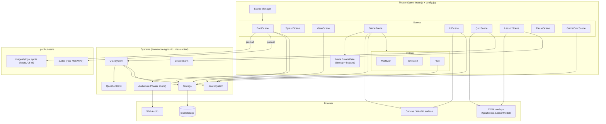
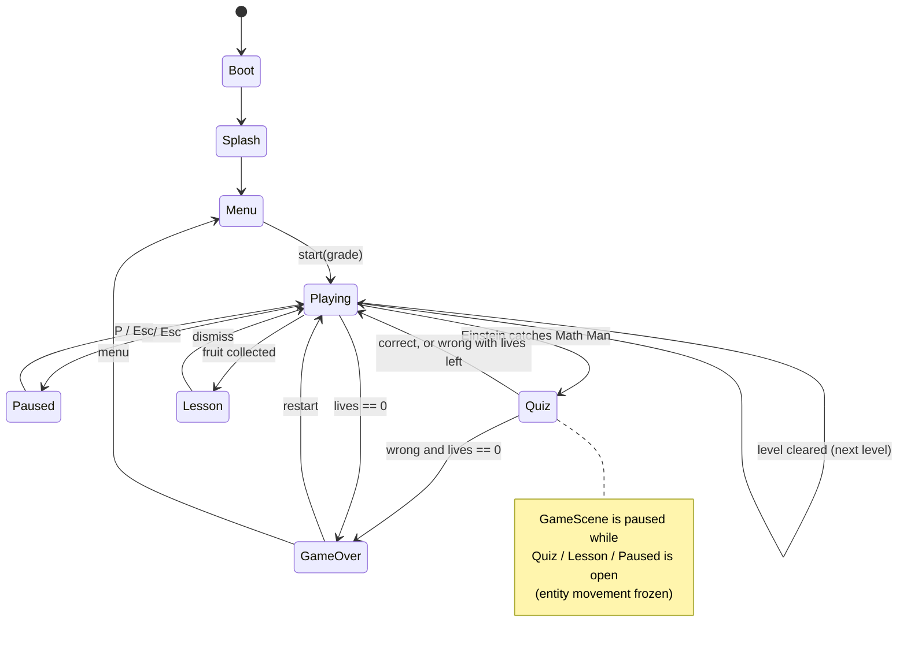
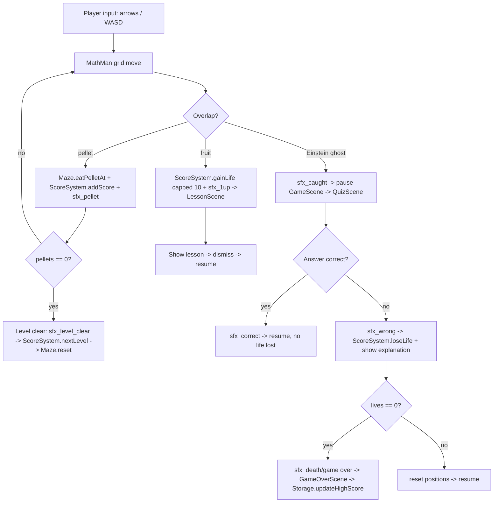
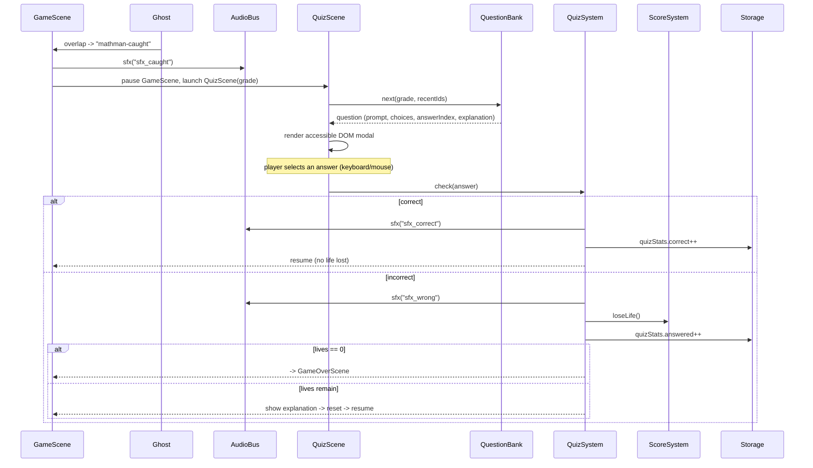
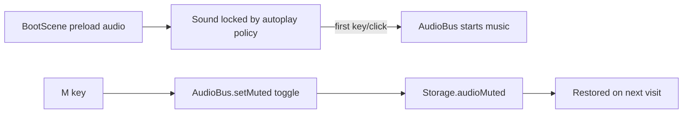

# Design Document

## Overview

Math Man is a client-side, single-page browser game built on **Phaser 3**, the open-source 2D HTML5 game framework. Phaser provides a WebGL renderer (with automatic Canvas fallback), a scene manager, arcade physics, tilemaps, input handling, and a Web Audio–based sound manager — all of which map directly onto this game's needs (maze rendering, state screens, collisions, and full music/SFX).

The project is bundled with **Vite** (fast dev server with hot-reload, and a static production build). The output is plain static files (HTML/JS/assets) that deploy to any static host — no backend. All persistence uses `localStorage` with an in-memory fallback.

Rendering, menus, and gameplay are handled by Phaser Scenes. Text-heavy, accessible UI (the quiz form and the lesson panel) is rendered as **DOM overlays** layered above the Phaser canvas, so questions and lessons stay crisp, keyboard-navigable, and screen-reader friendly.

### Goals

- Faithful Pac-Man-style maze gameplay with grid-locked movement, GPU-accelerated via Phaser/WebGL.
- Educational core: Einstein ghosts trigger grade-appropriate (5/6/7) math quizzes; fruits grant a life plus a micro-lesson.
- 6 starting lives, hard cap of 10.
- Colorful Einstein ghosts (red, pink, cyan, orange).
- Splash screen with the Math Man logo, then a start menu with grade selection.
- Arcade-style music and sound effects for all events.
- Single global high score, difficulty preference, mute, and quiz stats persisted locally.

### Non-Goals

- No accounts, login, or server-side storage.
- No multiplayer or networked features.
- No native/desktop packaging; browser only.

## Technology Stack

| Concern | Choice | Rationale |
|---------|--------|-----------|
| Rendering + game loop | Phaser 3 (`Phaser.AUTO`) | WebGL with Canvas fallback; batched sprite rendering; mature 2D engine. |
| Bundler / dev server | Vite | Fast HMR in dev; small static build for production. |
| Scenes / state flow | Phaser Scene Manager | Splash/menu/game/game-over as scenes; overlays via parallel scenes. |
| Physics / overlap | Phaser Arcade Physics | Lightweight AABB overlap checks for pellet/fruit/ghost contact. |
| Maze | Phaser Tilemap | Wall layer for collision; grid coordinates for movement. |
| Audio | Phaser Sound Manager (Web Audio) | Preloaded/decoded assets, loop + global mute built in. |
| Accessible modals | DOM overlays (HTML) | Keyboard-navigable, high-contrast quiz/lesson UI over the canvas. |
| Persistence | `localStorage` (+ in-memory fallback) | No login; resilient local records. |
| Unit tests (optional) | Vitest | Runs against pure logic modules; pairs natively with Vite. |

Phaser is loaded as an npm dependency and pinned to an exact version in `package.json`.

## System Architecture

High-level component view: the Phaser game owns the scenes; scenes read/write the framework-agnostic systems; systems talk to the browser (localStorage, Web Audio) and the DOM overlays sit above the canvas.



## Project Structure

```
index.html                 # Vite entry; hosts #game container + DOM overlay root
package.json               # phaser (pinned), vite, (optional) vitest
vite.config.js
public/
  assets/
    images/                # Math Man art (see Image Assets section) + ASSETS.md
      02_logo.png          #   logo (splash/menu)
      03_app_icon.png      #   favicon / PWA icon source
      04_mascot_sprite_sheet.png   # Math Man animation frames
      05_collectibles_and_math_icons.png  # pellets, fruit, life icons
      06_ui_kit.png        #   HUD, buttons, modal styling
      09_hero_einstein_enemies.png # title/menu hero
      ...                  #   posters/hero originals for marketing
    audio/                 # Pac-Man *.wav music + sfx (+ NOTICE.md; see Audio System)
src/
  main.js                  # Phaser.Game config; registers scene list
  config.js                # Constants: tile size, speeds, LIVES_START=6, LIVES_MAX=10, colors, timings
  scenes/
    BootScene.js           # Preload all assets; init Storage/AudioBus; -> SplashScene
    SplashScene.js         # Math Man logo + intro; auto-advance or key/click -> MenuScene
    MenuScene.js           # Logo/title, Play button, grade selector, high score
    GameScene.js           # Maze, entities, gameplay update loop
    UIScene.js             # HUD overlay (score, lives, level, high score) run in parallel
    QuizScene.js           # Pauses GameScene; opens DOM quiz; resolves outcome
    LessonScene.js         # Pauses GameScene; opens DOM lesson; resumes
    PauseScene.js          # Pause overlay
    GameOverScene.js       # Final + high score; restart or menu
  entities/
    MathMan.js             # Player sprite (frames from 04_mascot_sprite_sheet.png): movement, animation
    Ghost.js               # Einstein ghost sprite: per-color frames, AI personality, movement
    Fruit.js               # Fruit sprite (from 05_collectibles_and_math_icons.png): spawn, collect
  maze/
    mazeData.js            # Tile layouts (per level)
    Maze.js                # Tilemap build + helpers: isWall, tile<->pixel, tunnel wrap, pellets
  systems/
    QuizSystem.js          # Orchestrates a quiz round; checks answers; updates stats
    QuestionBank.js        # Generated + curated questions per grade; no-repeat
    LessonBank.js          # Math/science micro-lessons for fruit
    ScoreSystem.js         # Score, lives (6..10), level progression, game-over
    Storage.js             # localStorage wrapper w/ in-memory fallback
    AudioBus.js            # Event->sound mapping over Phaser sound; music crossfade; mute persist
  ui/
    QuizModal.js           # Builds/controls the DOM quiz form used by QuizScene
    LessonModal.js         # Builds/controls the DOM lesson panel used by LessonScene
```

`QuestionBank`, `LessonBank`, `ScoreSystem`, `Storage`, and the pure helpers in `Maze` are framework-agnostic (no Phaser imports) so they stay unit-testable and reusable.

## Image Assets

Art lives in `public/assets/images/` (catalogued in `ASSETS.md`). These PNGs were AI-generated for the project; they are loaded in `BootScene` and mapped to game elements as follows.

| File | Role in game | Loaded as |
|------|--------------|-----------|
| `02_logo.png` | Logo on SplashScene and MenuScene (Req 11.1, 11.2) | image |
| `03_app_icon.png` | Favicon / PWA icon (Req 11.5) | referenced from `index.html` / manifest |
| `04_mascot_sprite_sheet.png` | Math Man movement/pose frames (Req 13.1) | spritesheet / atlas |
| `05_collectibles_and_math_icons.png` | Pellets, fruit, life icons (Req 13.2) | spritesheet / atlas |
| `06_ui_kit.png` | HUD, buttons, modal styling cues (Req 13.3) | image / 9-slice where useful |
| `08_poster_einstein_enemies.png` | Ghost concept reference; marketing | image (menu/marketing) |
| `09_hero_einstein_enemies.png` | Title/menu hero background (Req 11.2) | image |
| `01_poster_original.png`, `07_hero_original.png` | Original concept/marketing art | not required at runtime |

Implementation notes:

- The mascot and collectibles sheets need frame definitions (either fixed-size `spritesheet` frames or a JSON `atlas`); the exact frame size/coordinates are established when wiring animations in the entity tasks.
- Source PNGs are high-resolution (~1.5-2 MB each); optimized/resized copies should be produced for runtime to keep load times reasonable (Req 11.3, 13.6).
- Every image load is guarded: on failure the game falls back to drawn shapes/text so it still boots and plays (Req 13.5; see Error Handling).

## Scene Architecture (replaces the manual state machine)

Phaser's Scene Manager provides the state flow. Overlay scenes are launched in parallel over a paused `GameScene` rather than tearing it down, so the frozen maze stays visible beneath them.

```
BootScene ──> SplashScene ──> MenuScene ──> GameScene (+ UIScene parallel)
                                 ^                │
                                 │                ├─ launch PauseScene   (pause GameScene) ── resume
                                 │                ├─ launch QuizScene     (pause GameScene)
                                 │                │     ├─ correct / wrong+lives ─> resume GameScene
                                 │                │     └─ wrong & lives==0 ─────> GameOverScene
                                 │                ├─ launch LessonScene   (pause GameScene) ── resume
                                 │                └─ level cleared ──────────────> next level (restart GameScene data)
                                 │
                            GameOverScene ── restart ─> GameScene
                            GameOverScene ── menu ────> MenuScene
```

The same flow as a state diagram:



| Scene | Runs GameScene? | Responsibility |
|-------|-----------------|----------------|
| BootScene | — | Preload assets, init Storage + AudioBus, then start Splash. |
| SplashScene | — | Show logo; auto-advance (~2s) or on key/click (Req 7.1, 7.2). |
| MenuScene | — | Logo/title, Play, grade selector (5/6/7), high score (Req 7.3, 10.1). |
| GameScene | active | Maze, Math Man, ghosts, fruit, gameplay `update()`. |
| UIScene | parallel | HUD: score, lives, level, high score (Req 1.6). |
| PauseScene | paused | Pause overlay; toggles back to GameScene (Req 7.5). |
| QuizScene | paused | Einstein-caught quiz via DOM modal (Req 3.3, 4.x). |
| LessonScene | paused | Fruit micro-lesson via DOM panel (Req 5.3, 5.4). |
| GameOverScene | stopped | Final + high score; restart or menu (Req 7.6). |

When `QuizScene`/`LessonScene`/`PauseScene` launch, they call `this.scene.pause('GameScene')`, which halts its `update()` — freezing all entity movement (satisfies Req 3.3, 4.6, 5.4). The frozen frame remains rendered underneath.

## Event Flow

Key runtime interactions between the scenes and systems. Each overlap/collision is detected in `GameScene.update()` and routed to the relevant system, with `AudioBus` firing the matching cue.

### Gameplay collisions and outcomes



### Einstein quiz sequence



### Audio unlock and mute



## Game Loop and Movement

Phaser drives the loop; `GameScene.update(time, delta)` runs each frame while active. There is no hand-written `requestAnimationFrame`.

Movement is **grid-locked** for authentic Pac-Man feel:

- Each mover (Math Man, ghosts) tracks a current `direction` and a `nextDirection` intent.
- An entity may only change direction when it is centered on a tile (within a small epsilon) and the target tile is not a wall — classic "turn buffering."
- Between tile centers, the sprite advances at a constant speed along `direction`; wall tiles block continued movement.
- Wall checks use the tilemap's collision layer (`Maze.isWall`). Pellet, fruit, and ghost contact use Arcade Physics `overlap` for cheap AABB checks.

## Maze Model

The maze is defined in `mazeData.js` as rows of tile codes and built into a Phaser Tilemap by `Maze.js`.

| Code | Meaning |
|------|---------|
| `#` | Wall (collision tile) |
| `.` | Pellet |
| ` ` | Empty path |
| `o` | Power pellet (reserved for optional future frightened mode) |
| `M` | Math Man spawn |
| `G` | Ghost house spawn |
| `F` | Fruit spawn point |
| `-` | Tunnel / horizontal wrap edge |

`Maze.js` exposes:

- `isWall(col, row)` — via the tilemap collision layer.
- `pelletCount()` / `eatPelletAt(col, row)` — pellets tracked as a sprite group; eating removes the sprite and returns points.
- `tileToWorld(col, row)` / `worldToTile(x, y)`.
- `wrapIfTunnel(entity)` — horizontal wrap-around at tunnel edges.
- `reset(level)` — rebuild pellet layer (and optionally swap layout) for the next level.

Pellets and fruit render as Phaser sprites/images in groups above the tile layer, using icons cut from `05_collectibles_and_math_icons.png` (Req 13.2); Math Man and ghosts render above pellets.

## Entities

Entities extend Phaser sprite/GameObject classes so they participate in the display list and physics.

### MathMan

- Fields: `direction`, `nextDirection`, `speed` (from `config.js`).
- `setDirection(dir)` queues `nextDirection`; applied when tile-centered and unobstructed.
- `preUpdate`/scene `update` advances along `direction`, calls `Maze.wrapIfTunnel`, and relies on Arcade overlap for pellet/fruit pickup.
- Animation: frames sliced from `04_mascot_sprite_sheet.png` (loaded as a Phaser spritesheet/atlas) drive the movement/mouth animation, flipped/rotated to face `direction`. Falls back to a drawn wedge if the sheet fails to load (Req 13.1, 13.5).

### Ghost (Einstein)

- Four instances by default, colors `#ff0000` (red), `#ffb8ff` (pink), `#00ffff` (cyan), `#ffb852` (orange) (Req 3.2).
- Pac-Man-inspired `personality` for target selection:
  - Red — chase Math Man's tile directly.
  - Pink — target a few tiles ahead of Math Man's facing direction.
  - Cyan — vector target using Math Man and the red ghost.
  - Orange — chase when far, retreat to a corner when close.
- At each tile center, choose the non-reversing direction minimizing distance to the current target tile.
- Appearance: colored ghost body plus an Einstein motif (wild white hair, small mustache) so every ghost reads as Einstein while staying color-distinct (Req 3.5, 13.4). Implemented as per-color sprite frames, consistent with the concept art (`08_poster_einstein_enemies.png`, `09_hero_einstein_enemies.png`); falls back to a tinted drawn ghost if art is missing.
- Difficulty scales `speed` and chase/scatter cadence (Req 3.6, 10.4).
- On overlap with Math Man → emit a `mathman-caught` event; `GameScene` launches `QuizScene`.

### Fruit

- Spawns at an `F` tile on a timer or after a pellet threshold (configurable in `config.js`; Req 5.1), drawn from a fruit icon in `05_collectibles_and_math_icons.png`. Spawn plays the "fruit spawned" cue.
- On overlap with Math Man → `ScoreSystem.gainLife()` (capped at 10), then `GameScene` launches `LessonScene` with a `LessonBank` entry (Req 5.2, 5.3).

## Educational Systems

### QuestionBank (framework-agnostic)

Hybrid source: **generated** parametric arithmetic for volume/variety plus a **curated** pool for word problems and geometry.

```js
{
  id: string,            // stable/generated id for no-repeat tracking
  grade: 5 | 6 | 7,
  category: string,      // "fractions", "percent", "equations", ...
  prompt: string,
  choices: string[],     // multiple-choice options
  answerIndex: number,   // index of the correct choice
  explanation: string    // shown on wrong answer / feedback
}
```

Grade mapping (Req 4.2):

- **Grade 5:** multi-digit ×/÷, add/subtract like-denominator fractions, decimals to hundredths, rectangle area/perimeter.
- **Grade 6:** ratios & unit rates, percentages, integer operations, evaluate simple expressions.
- **Grade 7:** proportions, one/two-step linear equations, negatives, basic probability, circle area/circumference.

`QuestionBank.next(grade, recentIds)` returns a question whose `id` differs from the immediately previous one (Req 4.7).

### QuizSystem + QuizScene + QuizModal

- On `mathman-caught`, `GameScene` pauses and launches `QuizScene`, which builds an accessible DOM form via `QuizModal` (Req 3.3, 4.1).
- **Multiple-choice-first**: options selectable by mouse or keyboard (1-4 / arrows + Enter). Numeric entry is supported by the same modal where a category needs it.
- Correct → correct-answer SFX, positive feedback, no life lost, resume GameScene (Req 4.4).
- Wrong → wrong-answer SFX, show correct answer + explanation, `ScoreSystem.loseLife()`; if lives hit 0 → GameOverScene, else resume (Req 4.5).
- `QuizSystem` records quiz stats (attempts, correct) via `Storage` (Req 6.6).

### LessonBank + LessonScene + LessonModal

- Short math/science "did you know" lessons, tagged so repeats are avoided when possible (Req 5.5).
- `LessonScene` shows the DOM panel with a dismiss button; Enter/Esc closes and resumes GameScene (Req 5.4).

## Audio System

Audio uses the **Phaser Sound Manager**, which is Web Audio–backed. All clips are preloaded in `BootScene` (`this.load.audio(key, 'assets/audio/<file>.mp3')`) so they are decoded before play and fire with low latency (Req 12.7). `AudioBus` wraps Phaser's sound API to centralize the event→sound mapping, music crossfades, and mute persistence.

### Source assets

The sound set uses the classic Pac-Man effects pack (from The Spriters Resource, asset 404131) placed in `public/assets/audio/`. Files are supplied as **WAV**, which all four target browsers play natively.

- **Format note:** WAV works as-is; converting the short SFX and looping tracks to **MP3** is recommended to cut file size and speed loading (e.g., `ffmpeg -i in.wav out.mp3`). The `AudioBus` keys stay the same regardless of extension, so conversion is a drop-in swap.
- Looping music uses Phaser's `loop: true`; the `*_firstloop.wav` variants are the lead-in played once before the seamless loop body (Pac-Man's siren authored as intro + loop).
- **OGG** avoided as a sole source due to inconsistent Safari history.

### Event → sound mapping (Req 12.2)

Concrete mapping to the provided Pac-Man files:

| Event | Audio key | Source file(s) | Type |
|-------|-----------|----------------|------|
| Splash / title shown | `music_title` | `start.wav` | music (one-shot) |
| Menu shown | `music_menu` | `start.wav` (reused) | music |
| Game start | `sfx_intro` | `start.wav` | sfx (one-shot) |
| Gameplay running | `music_game` | `siren0_firstloop.wav` → `siren0.wav` (loop) | music (loop) |
| Pellet eaten | `sfx_pellet` | `eat_dot_0.wav` / `eat_dot_1.wav` (alternate) | sfx |
| Fruit spawned | `sfx_fruit_spawn` | `credit.wav` (soft cue) | sfx |
| Fruit collected / bonus | `sfx_fruit` | `eat_fruit.wav` | sfx |
| Extra life gained | `sfx_1up` | `extend.wav` | sfx |
| Einstein catches Math Man | `sfx_caught` | `eat_ghost.wav` | sfx |
| Quiz answered correctly | `sfx_correct` | `intermission.wav` (short positive cue) | sfx |
| Quiz answered incorrectly | `sfx_wrong` | `death_0.wav` | sfx |
| Life lost | `sfx_death` | `death_0.wav` + `death_1.wav` (sequence) | sfx |
| Level cleared | `sfx_level_clear` | `intermission.wav` | sfx |
| Game over | `music_gameover` | `death_1.wav` | music/sfx |
| New high score | `sfx_highscore` | `extend.wav` (reused) | sfx |
| Menu move / select | `sfx_select` | `credit.wav` | sfx |
| Pause / unpause | `sfx_pause` | `credit.wav` (reused) | sfx |

Escalating gameplay intensity (Req 12.8) uses `siren1..siren4` (with matching `*_firstloop.wav` lead-ins) swapped in by level/difficulty.

**Reserved / unused files** (kept for optional future modes, not wired by default): `fright.wav` + `fright_firstloop.wav` (power-pellet frightened mode), `eyes.wav` + `eyes_firstloop.wav` (ghost eyes returning to the house).

**Attribution/licensing note:** these are ripped Namco Pac-Man arcade sounds, suitable for a prototype/learning build. For any public release, replace them with original or appropriately licensed audio; the `AudioBus` mapping makes swapping files trivial.

### AudioBus API

```js
AudioBus.init(scene, storage)        // bind Phaser sound + restore mute state
AudioBus.sfx(key)                    // one-shot; no-op when muted
AudioBus.music(key, { loop:true })   // crossfade to a new track via volume tween
AudioBus.stopMusic()
AudioBus.setMuted(bool)              // Phaser this.sound.mute; persisted via Storage
AudioBus.isMuted()
```

- Mute persists in `localStorage` and restores on next visit (Req 12.4; Storage `audioMuted`).
- **Autoplay policy:** Phaser's sound manager stays locked until the first user gesture. `AudioBus` waits for Phaser's `unlocked` event (or the first key/click leaving Splash) before starting music, so nothing errors and audio begins after that interaction (Req 12.6).
- **Missing/failed assets:** per-asset load errors are caught in `BootScene`; the affected cue becomes a silent no-op and the game continues (Req 12.6).
- Muting never affects game logic or timing (Req 12.5). Difficulty/level may raise music tempo/intensity as an enhancement (Req 12.8).

## Score, Lives, Levels

`ScoreSystem` (framework-agnostic; `UIScene` and scenes read from it):

- `score`, `lives` (init 6, cap 10), `level`.
- `addScore(points)`, `loseLife()`, `gainLife()` (clamped ≤ 10; Req 2.5, 2.6).
- `isGameOver()` when `lives === 0` (Req 2.3).
- `nextLevel()` increments `level` and triggers `Maze.reset(level)`.
- Emits change events so `UIScene` updates the HUD.

## Storage

`Storage.js` wraps `localStorage` under one namespaced key, `mathman.v1`:

```js
{
  highScore: number,          // single global high score (Req 6, 10.6)
  lastDifficulty: 5 | 6 | 7,  // preselected next visit (Req 10.5)
  audioMuted: boolean,        // (Req 12.4)
  quizStats: { answered: number, correct: number }  // (Req 6.6)
}
```

- `load()` parses JSON; on parse error or unavailable storage, returns defaults and switches to an in-memory object (Req 6.5).
- `save(patch)` merges and writes inside try/catch so quota/denied errors never crash gameplay.
- `updateHighScore(score)` writes only when `score > highScore` (Req 6.4).

## Input

Input is handled per-scene using Phaser's keyboard plugin; the DOM overlays handle their own key events while open.

- Arrow keys / WASD → Math Man direction intent (GameScene).
- `P` / `Esc` → toggle pause (launch/stop PauseScene).
- `Enter` / `Space` → advance splash, confirm menu, submit quiz/lesson.
- `1`–`4` / arrows → select quiz answer (QuizScene DOM form).
- `M` → toggle mute (via AudioBus).

Because each scene owns its input, the same physical key does the right thing per context without a manual router.

## Branding / Logo

- `public/assets/images/02_logo.png`: the Math Man logo (Pac-Man-style character + math motif + wordmark); an optimized/exported SVG or smaller PNG is preferred for crisp scaling (Req 11.1, 11.3).
- `SplashScene` centers the logo with a short intro tween, then auto-advances (~2s) or on key/click (Req 7.1, 7.2).
- `MenuScene` shows the logo above the Play button and grade selector, optionally over the `09_hero_einstein_enemies.png` hero background (Req 11.2).
- `03_app_icon.png` is the source for the favicon/PWA icon, referenced from `index.html` (Req 11.5).
- Fallback: if the logo asset fails to load, scenes render a styled text title so the game still boots (Req 13.5).

## Error Handling

- **Storage failures:** caught; fall back to in-memory records; game continues (Req 6.5).
- **Asset load failure (logo/audio/sprites):** BootScene load-error handler marks the asset missing; the game boots with a text/logo fallback and silent audio for that cue.
- **Malformed maze/question data:** validated on load; a bad question is skipped and the next drawn so a quiz never dead-ends.
- **Autoplay blocked:** handled by AudioBus unlock flow (above); never throws.
- **Overlay open:** GameScene is paused, so stray movement input cannot desync the simulation.

## Testing Strategy

Vite pairs natively with **Vitest** for the framework-agnostic logic. Tests are optional and would be added only on request.

- **Unit-testable pure modules:** `QuestionBank` (correct answer, grade mapping, no-repeat), `ScoreSystem` (life clamp 6..10, game-over at 0), `Storage` (fallback + high-score update), `Maze` helpers (isWall, tile/world conversion, tunnel wrap).
- **Manual/integration checks:** scene transitions (splash→menu→play→quiz→resume/game-over), ghost AI sanity, audio unlock + mute, and a cross-browser smoke test on Chrome/Firefox/Safari/Edge.

## Key Design Decisions & Trade-offs

1. **Phaser 3 + Vite.** GPU-accelerated rendering, built-in scenes/physics/audio, and a fast build. Trade-off: one framework dependency and a build step, accepted for polished Pac-Man-grade rendering and full audio.
2. **Phaser scenes for flow; DOM overlays for quiz/lesson.** Scenes give clean state transitions and keep the frozen maze visible; DOM keeps the educational text accessible and keyboard-friendly.
3. **Grid-locked movement over physics-driven movement.** Preserves authentic Pac-Man turning; Arcade physics is used only for cheap overlap detection.
4. **Framework-agnostic logic modules.** QuestionBank/LessonBank/ScoreSystem/Storage/Maze-helpers avoid Phaser imports so they stay testable and portable.
5. **Hybrid question source.** Generated arithmetic for endless non-repeating variety; curated items for quality word/geometry wording.
6. **All ghosts are colored Einsteins with distinct AI.** Matches the request while preserving classic chase variety.
7. **MP3 via Phaser Sound Manager with a mute master.** Broad compatibility, preloaded low-latency playback, and simple global mute persisted locally.
