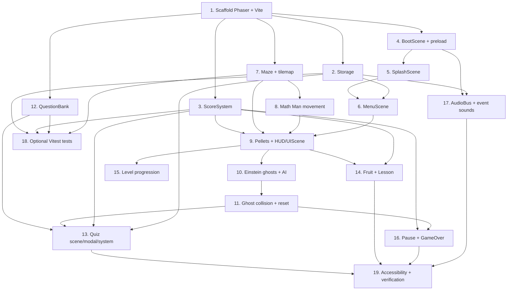

# Implementation Plan

## Overview

This plan implements Math Man as a Phaser 3 + Vite browser game, ordered so the game is runnable early and grows incrementally. Each task is coding-only and builds on prior tasks. Foundational modules (project scaffold, Storage, ScoreSystem) come first, followed by scenes and gameplay, then the educational systems (quiz/lesson), and finally audio, optional tests, and verification. Unit tests (Vitest) are optional; task 18 covers optional test coverage for the pure logic modules.

## Tasks

- [ ] 1. Scaffold the Phaser + Vite project
  - Create `package.json` with pinned `phaser` and `vite` (and `vitest` as an optional devDependency).
  - Add `vite.config.js` and an `index.html` that hosts a `#game` container and a DOM overlay root for modals.
  - Create `src/main.js` with the `Phaser.Game` config (`Phaser.AUTO`, Arcade physics, FIT scale mode) and an empty scene list placeholder.
  - Create `src/config.js` with core constants: `TILE_SIZE`, entity speeds, `LIVES_START = 6`, `LIVES_MAX = 10`, ghost colors, timings, storage key `mathman.v1`.
  - Verify `npm install` and `npm run dev` serve a blank Phaser canvas.
  - _Requirements: 8.1, 8.2, 8.3, 8.5_

- [ ] 2. Implement the Storage module with in-memory fallback
  - Create `src/systems/Storage.js` wrapping `localStorage` under the `mathman.v1` key.
  - Implement `load()`, `save(patch)`, and `updateHighScore(score)` with try/catch and an in-memory fallback object when storage is unavailable or JSON is malformed.
  - Model the shape: `highScore`, `lastDifficulty`, `audioMuted`, `quizStats { answered, correct }`.
  - _Requirements: 6.1, 6.2, 6.3, 6.4, 6.5, 6.6, 10.5, 10.6, 12.4_

- [ ] 3. Implement the ScoreSystem module
  - Create `src/systems/ScoreSystem.js` with `score`, `lives` (init 6), `level`.
  - Implement `addScore`, `loseLife`, `gainLife` (clamped to `LIVES_MAX = 10`), `isGameOver()` (lives === 0), and `nextLevel()`.
  - Emit change events (or expose getters) for the HUD to read.
  - _Requirements: 2.1, 2.2, 2.3, 2.4, 2.5, 2.6_

- [ ] 4. Build the BootScene and asset preload pipeline
  - Create `src/scenes/BootScene.js` that preloads images (logo, sprites, tiles) and audio (`.mp3` keys from the audio mapping), using placeholder assets where final art is missing.
  - Register a Phaser loader error handler that marks missing assets so later code can fall back gracefully.
  - Initialize `Storage` and transition to `SplashScene`.
  - _Requirements: 8.2, 11.1, 12.3, 12.7_

- [ ] 5. Build the SplashScene with the Math Man logo
  - Create `src/scenes/SplashScene.js` that centers `logo.svg` with a short intro tween.
  - Auto-advance to `MenuScene` after ~2s, or immediately on key/click.
  - Render a styled text title as a fallback if the logo asset failed to load.
  - _Requirements: 7.1, 7.2, 11.1, 11.3_

- [ ] 6. Build the MenuScene with grade selection and high score
  - Create `src/scenes/MenuScene.js` showing the logo/title, a Play button, a 5/6/7 grade selector, and the current high score from `Storage`.
  - Default the grade selection to the persisted `lastDifficulty` (or 5th grade), and persist changes.
  - Starting a game passes the chosen grade to `GameScene`.
  - _Requirements: 7.3, 7.4, 10.1, 10.2, 10.5, 11.2_

- [ ] 7. Implement the Maze model and tilemap
  - Create `src/maze/mazeData.js` (tile-code rows) and `src/maze/Maze.js` that builds a Phaser Tilemap with a wall collision layer.
  - Implement helpers: `isWall`, `tileToWorld`, `worldToTile`, `wrapIfTunnel`, `pelletCount`, `eatPelletAt`, and `reset(level)`.
  - Spawn pellets and fruit points as sprite groups from the tile codes.
  - _Requirements: 1.1, 1.3, 1.5_

- [ ] 8. Implement Math Man with grid-locked movement and input
  - Create `src/entities/MathMan.js` as a Phaser sprite with `direction`/`nextDirection`/`speed`.
  - Implement turn-buffered grid movement: change direction only when tile-centered and the target tile is not a wall; block on walls; wrap tunnels.
  - Wire arrow keys / WASD in `GameScene` to set the queued direction; add the mouth-open/close animation facing the direction.
  - _Requirements: 1.2, 1.3, 8.4_

- [ ] 9. Wire pellet collection, scoring, and the HUD (UIScene)
  - Create `src/scenes/GameScene.js` that builds the maze and Math Man and runs the gameplay `update()`.
  - Use Arcade overlap to eat pellets, remove them, and call `ScoreSystem.addScore`.
  - Create `src/scenes/UIScene.js` run in parallel to display score, lives, and level, updating on `ScoreSystem` events.
  - _Requirements: 1.1, 1.4, 1.6_

- [ ] 10. Implement Einstein ghosts and AI
  - Create `src/entities/Ghost.js` as a Phaser sprite with a color and a Pac-Man-style `personality` (red chase, pink ahead, cyan vector, orange chase/scatter).
  - Spawn four ghosts in distinct colors from the ghost house; compute non-reversing direction toward each ghost's target tile at tile centers.
  - Render the Einstein motif (hair/mustache) per color; scale speed/cadence by selected grade.
  - _Requirements: 3.1, 3.2, 3.5, 3.6, 10.4_

- [ ] 11. Implement ghost/Math Man collision and reset
  - Add Arcade overlap between ghosts and Math Man that emits a `mathman-caught` event.
  - On catch, pause `GameScene` and prepare to launch the quiz; after a resolved quiz, reset Math Man and ghosts to spawn positions when lives remain.
  - _Requirements: 3.3, 3.4_

- [ ] 12. Implement the QuestionBank
  - Create `src/systems/QuestionBank.js` with generated arithmetic plus a curated pool, tagged by grade and category.
  - Return questions in the documented shape (`prompt`, `choices`, `answerIndex`, `explanation`).
  - Implement `next(grade, recentIds)` that avoids repeating the immediately previous question and maps categories per grade (5/6/7).
  - _Requirements: 4.1, 4.2, 4.7_

- [ ] 13. Build the QuizScene, QuizModal, and QuizSystem
  - Create `src/ui/QuizModal.js` (accessible DOM form: prompt, multiple-choice options, numeric entry where needed, keyboard 1-4/arrows + Enter).
  - Create `src/scenes/QuizScene.js` that pauses `GameScene`, opens the modal with a `QuestionBank` question, and blocks movement while open.
  - Create `src/systems/QuizSystem.js` to check the answer: correct -> resume with no life lost; wrong -> show correct answer + explanation, `loseLife()`, then resume or go to game over; update `quizStats` in `Storage`.
  - _Requirements: 4.1, 4.3, 4.4, 4.5, 4.6, 6.6_

- [ ] 14. Implement fruit, LessonBank, and the LessonScene
  - Create `src/entities/Fruit.js` that spawns at an `F` tile on a timer or pellet threshold.
  - Create `src/systems/LessonBank.js` with tagged math/science micro-lessons that vary between showings.
  - On fruit overlap, call `ScoreSystem.gainLife()` (capped at 10) and launch `src/scenes/LessonScene.js` (DOM panel via `src/ui/LessonModal.js`) that pauses the game and resumes on dismiss.
  - _Requirements: 5.1, 5.2, 5.3, 5.4, 5.5, 2.4, 2.5_

- [ ] 15. Implement level progression and level-clear handling
  - Detect when `pelletCount()` reaches 0, play the level-clear transition, call `ScoreSystem.nextLevel()`, and rebuild the maze via `Maze.reset(level)`.
  - Preserve score/lives and selected difficulty across levels.
  - _Requirements: 1.5, 7.7_

- [ ] 16. Build the PauseScene and GameOverScene
  - Create `src/scenes/PauseScene.js` toggled by `P`/`Esc` that pauses `GameScene` and halts movement.
  - Create `src/scenes/GameOverScene.js` shown when `isGameOver()` is true, displaying final score and high score, updating the stored high score, and offering restart or return-to-menu (preserving difficulty on restart).
  - _Requirements: 7.5, 7.6, 7.7, 6.2, 6.4_

- [ ] 17. Implement the AudioBus and wire all event sounds
  - Create `src/systems/AudioBus.js` over the Phaser Sound Manager: `sfx(key)`, `music(key, {loop})` with crossfade, `stopMusic`, `setMuted`, `isMuted`.
  - Handle the autoplay-unlock flow (start music after Phaser `unlocked`/first gesture) and per-asset missing-sound no-ops.
  - Trigger each mapped cue (title/menu/game music, intro, pellet, fruit spawn/collect, 1-up, caught, correct, wrong, death, level clear, game over, high score, menu select, pause).
  - Wire `M` to toggle mute and persist `audioMuted` via `Storage`; ensure muting never affects game logic.
  - _Requirements: 12.1, 12.2, 12.3, 12.4, 12.5, 12.6, 12.7, 12.8, 9.4_

- [ ] 18. (Optional) Add Vitest unit tests for pure logic modules
  - Configure Vitest and add tests for `ScoreSystem` (life clamp 6..10, game-over at 0), `QuestionBank` (grade mapping, correct answer, no-repeat), `Storage` (fallback + high-score update), and `Maze` helpers (isWall, tile/world conversion, tunnel wrap).
  - _Requirements: 2.5, 2.6, 4.2, 4.7, 6.4, 6.5_

- [ ] 19. Accessibility, fallbacks, and final verification
  - Ensure quiz/lesson modals are keyboard-operable and dismissible, with sufficient contrast; add visible life gain/loss feedback.
  - Confirm graceful fallbacks: missing logo -> text title, missing audio -> silent, blocked/absent `localStorage` -> in-memory records.
  - Run `npm run build` and smoke-test the production build on Chrome, Firefox, Safari, and Edge.
  - _Requirements: 9.1, 9.2, 9.3, 6.5, 11.3, 8.1, 8.5_

## Task Dependency Graph

Tasks grouped into waves; tasks within the same wave can be worked in parallel once the previous waves are complete.

```json
{
  "waves": [
    { "wave": 1, "tasks": [1], "description": "Project scaffold (foundation for everything)." },
    { "wave": 2, "tasks": [2, 3, 4, 7, 12], "description": "Independent core modules that only need the scaffold." },
    { "wave": 3, "tasks": [5, 8, 17, 18], "description": "Splash, Math Man movement, audio bus, optional tests." },
    { "wave": 4, "tasks": [6], "description": "Menu (needs splash flow and storage)." },
    { "wave": 5, "tasks": [9], "description": "GameScene + pellets + HUD (needs maze, movement, score, menu entry)." },
    { "wave": 6, "tasks": [10, 14, 15], "description": "Ghosts, fruit/lesson, and level progression on top of gameplay." },
    { "wave": 7, "tasks": [11], "description": "Ghost collision + reset (needs ghosts)." },
    { "wave": 8, "tasks": [13, 16], "description": "Quiz flow and pause/game-over (need collision + question bank)." },
    { "wave": 9, "tasks": [19], "description": "Accessibility, fallbacks, and cross-browser verification." }
  ]
}
```



## Notes

- Requirement references map back to `requirements.md`; the design details each module in `design.md`.
- The game should be manually runnable after task 9 (maze, movement, pellets, HUD); ghosts and the educational loop layer on top.
- Task 18 is optional and only included because the design isolates pure logic modules for testability; skip it unless test coverage is wanted.
- Audio (task 17) is wired near the end so each event cue can attach to working game events, but placeholder MP3s can be dropped in earlier.
- Final art and audio assets can start as placeholders; the BootScene load-error handling keeps the game runnable until real assets are supplied.
