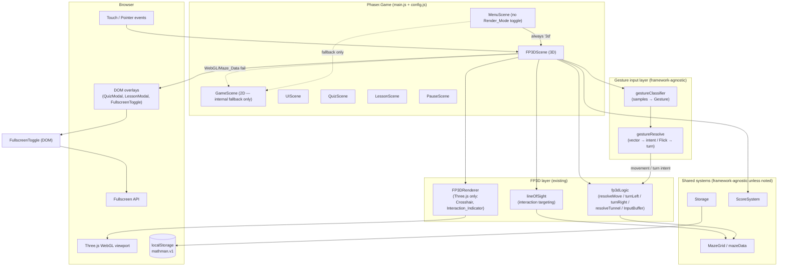
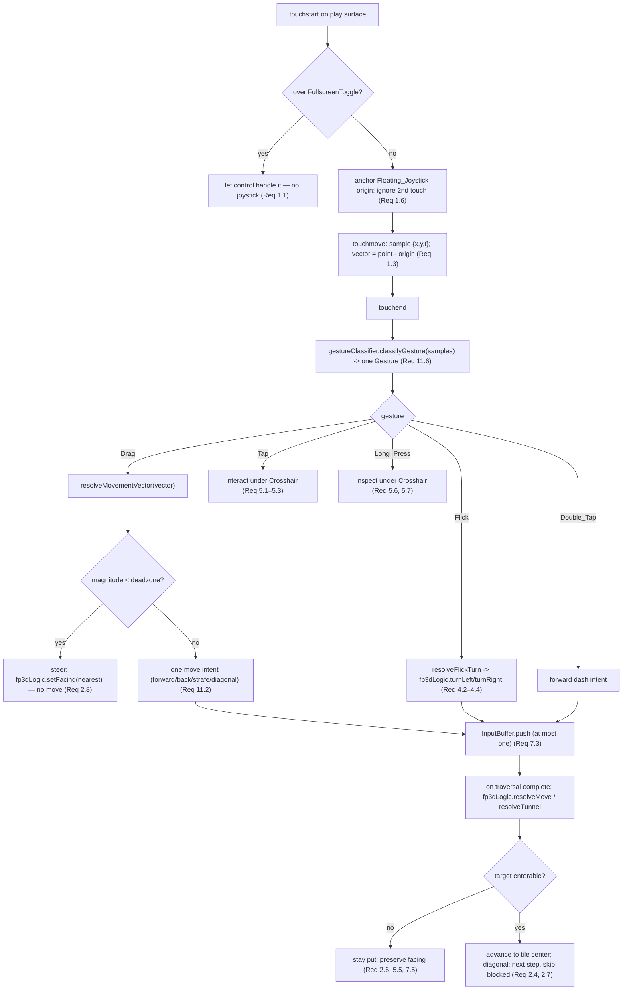
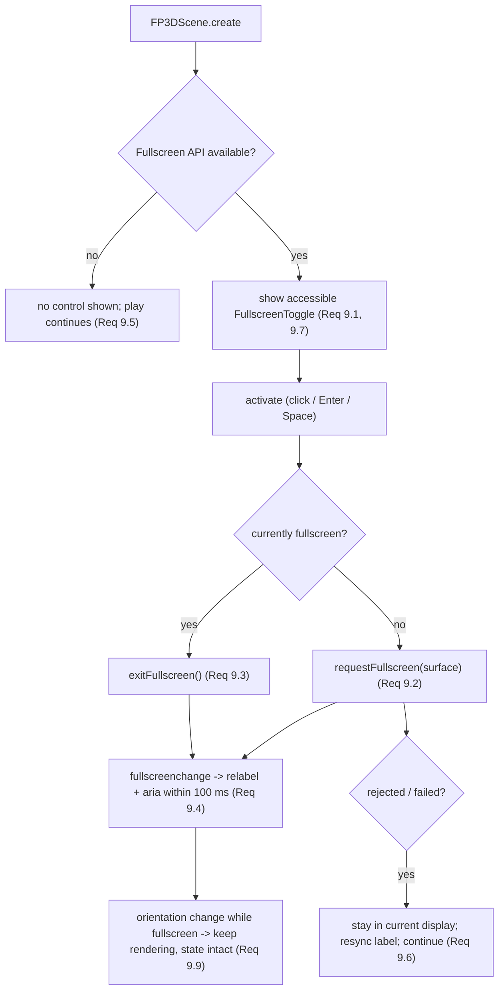
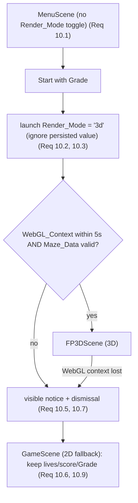

# Design Document

## Overview

This feature adds three capabilities **on top of the existing first-person 3D mode** (FP3D_Mode) without forking any gameplay logic: (A) **one-thumb mobile gesture controls**, (B) an accessible **Fullscreen_Toggle**, and (C) making FP3D_Mode the **only player-facing mode** while keeping 2D as the internal fallback. It builds directly on `.kiro/specs/first-person-3d-mode/design.md` and reuses that spec's architecture, component boundaries, and glossary (`FP3D_Renderer`, `FP3D_Controller`, `Maze_Data`, `Render_Mode`, `WebGL_Context`, `Storage`).

The scheme is an **input-mapping layer**, not a new movement model. Raw touch samples become a classified **Gesture** and a **Movement_Vector**; that vector is resolved to a *discrete* movement intent or a *cardinal* turn intent; those intents feed the **existing** `fp3dLogic` grid-locked resolution (`resolveMove`, `turnLeft`, `turnRight`, `resolveTunnel`, `InputBuffer`) exactly as keyboard input does today. Where the 2D `GameScene` calls a system method, and where keyboard input calls `fp3dLogic`, the gesture layer calls the identical methods — it never forks movement, turn, tunnel, or buffering behavior (Req 7, Req 2.5).

The new **framework-agnostic** logic lives in two pure modules — a **Gesture_Classifier** (raw touch samples `{x, y, t}` → one Gesture) and a **vector-to-direction resolver** (Movement_Vector → exactly one movement intent, or a steer intent below the deadzone; and a Flick → exactly one cardinal turn). Both import neither Phaser nor Three.js (Req 11.1). The touch DOM/event wiring, the Crosshair/Interaction_Indicator, and the Fullscreen_Toggle live in the Phaser/DOM layer (`FP3DScene` + a new DOM `FullscreenToggle` helper), never in the pure modules.

Part C flips the default: the menu no longer offers a **Render_Mode** choice, the game always launches `'3d'`, and `'2d'` is retained **only** as the automatic fallback when a `WebGL_Context` or `Maze_Data` is unavailable. This supersedes the FP3D spec's menu behavior (its Req 6.1/6.2/6.3/6.6) while keeping the fallback of FP3D Req 1.6/8.1/8.5 unchanged.

### Goals

- Full one-thumb play: touch-and-hold anchors an invisible **Floating_Joystick**; Drag → grid-locked move/steer; Flick → cardinal turn; Tap/Double_Tap/Long_Press → interact/dash/inspect — no simultaneous second touch required (Req 1.5, 5).
- Resolve every analog-feeling gesture to a **discrete grid move or cardinal turn** through the *existing* `fp3dLogic`, so FP3D_Mode gains no second movement system (Req 7.1, 7.2).
- Keep the new gesture-classification and vector-to-direction logic **framework-agnostic** and covered by mandatory `fast-check` property tests (≥100 cases each) (Req 11).
- Preserve keyboard operability as an interchangeable, always-available input path (Req 8.1–8.3).
- Provide an accessible, keyboard-operable **Fullscreen_Toggle** that reflects state and degrades gracefully (Req 9).
- Always launch FP3D_Mode; retain 2D purely as the internal WebGL/Maze_Data fallback with progress preserved (Req 10).

### Non-Goals

- No new movement model, no second source of maze truth — gestures feed the existing `fp3dLogic`, and `getLevelLayout()` via `Maze_Data` remains the only maze source (Req 7, Req 10.7).
- No new runtime dependency — the Fullscreen API and touch events are browser built-ins; Three.js stays pinned exactly as-is (Req 9.2 of FP3D remains in force; nothing added here).
- No player-facing 2D/3D toggle — 2D is not selectable, only a fallback (Req 10.1, 10.4).
- No change to the shared educational loop (quiz-on-capture, fruit, lives, scoring, persistence) — all reused unchanged.

## Technology Stack

| Concern | Choice | Rationale |
|---------|--------|-----------|
| Touch input source | **Browser Touch/Pointer events** (built-in) | `touchstart`/`touchmove`/`touchend` (with a Pointer Events fallback) are evergreen-browser built-ins; no library needed. Wired in `FP3DScene` only. |
| Gesture classification | Framework-agnostic ES module (`gestureClassifier.js`) | Pure `{x,y,t}` samples → one Gesture; imports neither Phaser nor Three.js (Req 11.1), so it is unit- and property-testable. |
| Vector → direction resolution | Framework-agnostic ES module (`gestureResolve.js`) | Pure Movement_Vector → one movement/steer intent, and Flick → one cardinal turn; also pure and PBT-covered (Req 11.2–11.5). |
| Grid-locked movement / turn / tunnel / buffer | **Existing** `src/systems/fp3d/fp3dLogic.js` (reused) | Gesture intents call `resolveMove`, `turnLeft`, `turnRight`, `resolveTunnel`, `InputBuffer` — no fork (Req 7.1–7.4). |
| Fullscreen | **Browser Fullscreen API** (built-in) | `requestFullscreen` / `exitFullscreen` / `fullscreenchange` / `fullscreenElement`, with vendor-prefixed fallbacks; no dependency (Req 9). |
| Fullscreen control + Crosshair/indicator | DOM overlay + `FP3D_Renderer` | Accessible DOM button (`FullscreenToggle`); Crosshair and Interaction_Indicator drawn by the renderer (Req 6, Req 9.1, 9.7). |
| Host engine / scene flow | Phaser 3 (`3.90.0`, existing) | `FP3DScene` wires touch/keyboard input and launches overlays; `MenuScene` drops the Render_Mode toggle (Req 10.1). |
| 3D rendering + camera | **Three.js `0.186.0`** (pinned exact, existing) | Unchanged. FP3D_Renderer already owns it; no version change and no new 3D dependency. |
| Persistence | `localStorage` + in-memory fallback (existing `Storage`) | `renderMode` record retained for the fallback path; launch ignores it and forces `'3d'` (Req 10.3). |
| Tests | Vitest + `fast-check` (existing) | Property-based tests mandatory for the new pure gesture logic (`.kiro/steering/testing.md`, Req 11). |

**Dependency policy:** **no new runtime dependency is added.** The Fullscreen API and touch/pointer events are browser built-ins, and gesture logic is plain ES modules. `package.json` keeps its existing pinned `phaser 3.90.0`, `vite 8.3.0`, `three 0.186.0`, `vitest 4.1.11`, and `fast-check 4.10.2` — no additions, no range or wildcard.

## Architecture

Phaser still hosts FP3D_Mode. The new gesture input layer sits **in front of** the existing `fp3dLogic`: `FP3DScene` collects raw touch samples, feeds them to the framework-agnostic `Gesture_Classifier`, resolves the resulting Movement_Vector/Flick through the framework-agnostic resolver into a *movement intent* or *turn intent*, and then applies that intent through the **same** `fp3dLogic` seam keyboard input uses. Only `FP3DScene`/`FullscreenToggle` touch the DOM and browser APIs; only `FP3DRenderer` imports Three.js; the two new gesture modules import neither.



The rule the diagram encodes: `gestureClassifier` and `gestureResolve` are the **only** new logic, and they feed the **existing** `fp3dLogic` seam — the dashed `FP3DScene → GameScene` and `MenuScene → GameScene` arrows fire only on the internal fallback path (Req 10). Keyboard input (not drawn) enters `fp3dLogic` through the same seam, interchangeably with gesture intents (Req 8.3).

## Components and Interfaces

Two new **framework-agnostic** modules, one new **DOM** helper, and edits to `FP3DScene` / `FP3DRenderer` / `MenuScene` / `config.js`. No changes to `fp3dLogic` behavior — it is reused.

### `gestureClassifier` (framework-agnostic — `src/systems/fp3d/gestureClassifier.js`)

Consumes raw touch samples and emits exactly one Gesture per completed interaction. No Phaser, no Three.js (Req 11.1). Pure and deterministic: identical sample sequences yield identical output (Req 11.7).

```js
export const GESTURES = ['Touch_Hold', 'Drag', 'Flick', 'Tap', 'Double_Tap', 'Long_Press', 'Release'];

/**
 * Classify one completed touch interaction from its ordered samples.
 * @param {{x:number,y:number,t:number}[]} samples raw touch samples (dip + ms)
 * @param {object} thresholds GESTURE constants from config.js
 * @param {{ prevTapAt:number|null, prevTapPos:{x,y}|null }} [ctx] for Double_Tap
 * @returns {{ gesture: string, vector?: {x,y}, direction?: 'left'|'right' }}
 */
export function classifyGesture(samples, thresholds, ctx) { /* ... */ }

/** Live Movement_Vector during a hold: current point minus the anchor (Req 1.3). */
export function movementVector(anchor, point) { return { x: point.x - anchor.x, y: point.y - anchor.y }; }
```

Classification order (Req 4, 5, 11.6): compute duration `dt = last.t - first.t` and travel `dist = |last - first|`.

- **Flick** iff `dt <= Flick_Duration_Threshold` **and** `dist >= Flick_Distance_Threshold` **and** the movement direction is within `Flick_Angle_Band` of horizontal; `direction` is `'left'|'right'` by sign of `dx`. Otherwise a moving interaction is a **Drag** (Req 4.1, 4.5, 4.6, 11.6).
- **Tap** iff `dt <= Tap_Duration_Threshold` and `dist < Tap_Move_Tolerance` (Req 5.8); **Double_Tap** when two Taps start within `Double_Tap_Interval` at positions within `Tap_Move_Tolerance` (Req 5.9); **Long_Press** iff stationary (`dist < Tap_Move_Tolerance`) held `>= Long_Press_Duration` (Req 5.10).
- **Touch_Hold** while pressed and not yet resolved; **Release** on lift (Req 1.1, 1.4).

The classifier maps each completed sequence to **exactly one** member of `GESTURES` (Req 11.6).

### `gestureResolve` (framework-agnostic — `src/systems/fp3d/gestureResolve.js`)

Pure Movement_Vector → movement intent, and Flick → cardinal turn. No Phaser, no Three.js (Req 11.1).

```js
export const MOVE_INTENTS = ['forward', 'backward', 'strafe-left', 'strafe-right', 'diagonal'];

/**
 * Resolve a Movement_Vector to exactly one intent (Req 11.2, 11.3).
 * Screen coords: up = -y. Angle measured from straight up.
 * @returns {{ kind:'move', intent:string, steps:string[] } | { kind:'steer', toward:string }}
 *   - magnitude < Movement_Deadzone  -> { kind:'steer', toward:<nearest cardinal> }   (Req 2.8, 11.3)
 *   - deviation from up <= Forward_Assist_Cone -> forward snap (Req 3.1, 3.3, 11.4)
 *   - within a Cardinal_Sector (±45°)          -> forward/backward/strafe (Req 2.1–2.3)
 *   - otherwise diagonal -> two nearest cardinals, dominant-axis-first (Req 2.4)
 */
export function resolveMovementVector(vector, thresholds) { /* ... */ }

/**
 * Resolve a classified Flick to exactly one cardinal turn intent (Req 4.2, 4.3, 11.5).
 * @param {'north'|'east'|'south'|'west'} facing current facing
 * @param {'left'|'right'} direction Flick direction
 * @returns {'north'|'east'|'south'|'west'} the single resulting cardinal (via fp3dLogic.turnLeft/turnRight)
 */
export function resolveFlickTurn(facing, direction) { /* delegates to fp3dLogic.turnLeft/turnRight */ }
```

`resolveMovementVector` returns **exactly one** outcome for every vector (totality, Req 11.2): a `steer` below the deadzone, otherwise a single `move` intent. The forward-assist cone takes precedence over the cardinal sectors (Req 3.1, 3.3). A `diagonal` carries its ordered `steps` (the two nearest cardinals, dominant axis first) that `FP3DScene` feeds one at a time through `fp3dLogic.resolveMove`, skipping any blocked step (Req 2.4, 2.7). `resolveFlickTurn` delegates to the existing `fp3dLogic.turnLeft`/`turnRight`, so a turn always settles on exactly one cardinal (Req 4.2–4.4, 11.5) — the resolver never introduces an intermediate facing.

### Interactable mapping (closing the requirements gap)

`requirements.md` (Req 5, 6) writes `Interactable` generically ("a door, ladder, dialogue trigger, or pickup") but Math Man's FP3D_Mode has no such entity today — pellets and fruit auto-collect on tile *entry* (`MazeGrid.eatPelletAt`, `_onFruitCollected`) and a ghost auto-triggers the quiz on tile *occupancy* (`_checkCapture`), all driven by movement alone, never by a targeted action. Requirements 5/6 are unimplementable until `Interactable` is pinned to real game entities, so this design makes that mapping explicit rather than leaving `interactUnderCrosshair()` to guess at runtime:

| Entity | Is it an Interactable? | Tap (primary) | Long_Press (secondary / inspect) |
|---|---|---|---|
| **Fruit** (present, in range) | **Yes** | Collect it now (calls the exact same path as tile-entry collection: `ScoreSystem.gainLife` + `LessonScene` launch) — lets the Player grab a fruit they can see without walking onto its tile first. | Show the Interaction_Indicator label `"COLLECT"`; Long_Press previews the fruit's micro-lesson topic (e.g. `"space"`) as the label text without launching `LessonScene` or consuming the fruit. |
| **Pellet / power-pellet** | **No** | — | — |
| **Ghost** | **No** | — | — |

Rationale: fruit is the ONLY world object in FP3D_Mode with a discrete "act on it" moment that isn't already fully driven by grid movement (a ghost catches you by standing on your tile regardless of facing or Tap; a pellet is silently swept up the instant you enter its tile, and requiring a Tap to collect a pellet would make ordinary walking feel broken). Making fruit Tap-collectible is additive, not a replacement — walking onto a fruit's tile still collects it automatically (Req 7.1 unaffected); Tap is a convenience that fires the identical `ScoreSystem.gainLife` + `LessonScene` seam `_onFruitCollected` already uses, so it forks no logic. Pellets and ghosts are deliberately **not** Interactables: they keep their existing automatic behavior, and a Tap or Long_Press aimed at one is a no-op per Req 5.3/5.7 ("no Interactable under the Crosshair").

This keeps `interactUnderCrosshair()` a thin adapter: walk the Crosshair ray with the existing `lineOfSight` tile walk, find the nearest **present, in-range** fruit tile on that ray, and either call the existing fruit-collection path (Tap) or drive `FP3DRenderer.setInteractionIndicator('COLLECT')` (proximity affordance, Req 6.1). No new Interactable registry, entity class, or Interactable data model is introduced — `state.fruits` (already tracked per FP3D runtime state) is the sole source. If a future task adds doors/ladders/pickups beyond fruit, they extend this same table and targeting adapter; they are out of scope here.

### `FP3DScene` (Phaser — edits)

Adds the touch input path alongside the existing keyboard path; both feed the same `fp3dLogic` seam (Req 8).

```js
create()  // existing setup + attach touch/pointer listeners on the game surface;
          //   construct FullscreenToggle; build InputBuffer (existing).
onTouchStart(e) // if the point is over an interactive control (FullscreenToggle) -> ignore (Req 1.1);
                //   else anchor Floating_Joystick origin; ignore a 2nd concurrent touch (Req 1.6).
onTouchMove(e)  // sample {x,y,t}; compute movementVector; if frozen -> ignore (Req 8.4).
onTouchEnd(e)   // classifyGesture(samples) -> dispatchGesture(); clear origin (Req 1.4).
dispatchGesture(g, facing) // route one Gesture to the existing fp3dLogic seam:
  // Drag  -> resolveMovementVector -> move: InputBuffer.push(intent) / diagonal steps;
  //          steer: fp3dLogic.setFacing(nearest) with no move (Req 2.8)
  // Flick -> resolveFlickTurn -> InputBuffer.push(turn)  (Req 4)
  // Tap   -> interactUnderCrosshair() (Req 5.1–5.3)
  // Double_Tap -> InputBuffer.push(forward dash) (Req 5.4, 5.5)
  // Long_Press -> inspectUnderCrosshair() (Req 5.6, 5.7)
```

- **Buffering & traversal:** every move/turn intent is pushed into the **existing** `InputBuffer` (at most one; extras dropped) and applied by the existing traversal-complete path (Req 7.3). Tunnel crossings go through the existing `fp3dLogic.resolveTunnel` (Req 7.4). A blocked target keeps the player put and preserves facing via the existing `resolveMove`/wall rule (Req 2.6, 5.5, 7.5).
- **Freeze:** while a quiz/lesson overlay is open the scene is frozen — all gesture-derived move/turn intents ignored, matching existing FP3D freeze (Req 8.4).
- **Interaction targeting:** `interactUnderCrosshair()`/`inspectUnderCrosshair()` walk the Crosshair ray via the existing `lineOfSight` walk and target the nearest **present, in-range** fruit (see "Interactable mapping" above — fruit is the only Interactable; pellets and ghosts are not) within `interactionRangeTiles`; Tap collects it through the existing fruit-collection seam, Long_Press shows its lesson-topic preview, and either is a no-op when no fruit is targeted (Req 5.1–5.3, 5.6, 5.7, 6.5).
- **Reduced_Motion:** gesture steering and Flick turns still change grid-locked position/cardinal facing but suppress non-essential camera motion via the existing renderer flag (Req 4.7, 8.5).

### `FP3DRenderer` (Three.js only — edits)

```js
setCrosshair(visible)                 // fixed center reticle (existing/extended).
setInteractionIndicator(label|null)   // centered dot + label (<=24 chars) when the
                                       //   targeted fruit (see "Interactable mapping")
                                       //   is under the Crosshair within range;
                                       //   hidden within 100 ms when none / out of range /
                                       //   removed (Req 6.1–6.3, 6.5, 6.6); no non-essential
                                       //   animation under Reduced_Motion (Req 6.4).
```

The Floating_Joystick has **no persistent** on-screen control; any origin marker is drawn only under the touching finger and never obscures the Crosshair (Req 1.2).

### `FullscreenToggle` (DOM — `src/ui/FullscreenToggle.js`)

An accessible DOM control (a real `<button>`), layered above the canvas like the other overlays.

```js
export function createFullscreenToggle(surfaceEl, { onError } = {}) {
  // Returns { el, destroy } or null when the Fullscreen API is unavailable (Req 9.5).
  // - accessible name: "Enter fullscreen" | "Exit fullscreen"; role=button; aria-pressed (Req 9.1, 9.7)
  // - click / Enter / Space -> requestFullscreen(surfaceEl) or exitFullscreen() (Req 9.2, 9.3, 9.7)
  // - listens for 'fullscreenchange' -> updates label + aria within 100 ms (Req 9.4)
  // - a rejected/failed request leaves display state unchanged and resyncs label (Req 9.6)
  // - visible focus indicator via :focus-visible styling (Req 9.8)
}
```

When `document.fullscreenEnabled` / `requestFullscreen` is absent, `createFullscreenToggle` returns `null` and the game continues with no control (Req 9.5). Orientation changes while fullscreen on mobile are a browser resize event; FP3D_Mode keeps rendering with maze and player state unchanged (Req 9.9).

### `MenuScene` (Phaser — edits, Part C)

Remove the Render_Mode toggle UI and its handlers (`_buildRenderModeToggle`, `_selectRenderMode`, `_toggleRenderMode`, `_refreshRenderModeButtons`, `_loadPersistedRenderMode`). Starting a game always launches `FP3DScene` in `'3d'` regardless of any persisted `renderMode` (Req 10.1–10.3). The internal fallback to `GameScene` (2D) is unchanged and reached only on WebGL/Maze_Data failure (Req 10.4–10.9).

## Data Models

No new persisted data. The gesture layer is stateless between interactions apart from a small in-memory classifier context; the Fullscreen toggle reads live browser state.

**Gesture (in-memory, produced per interaction):**

```js
{ gesture: 'Touch_Hold'|'Drag'|'Flick'|'Tap'|'Double_Tap'|'Long_Press'|'Release',
  vector?: { x, y },            // Movement_Vector for Drag (screen dip; up = -y)
  direction?: 'left'|'right' }  // for Flick
```

**Movement intent (in-memory, resolver output):**

```js
{ kind: 'move', intent: 'forward'|'backward'|'strafe-left'|'strafe-right'|'diagonal', steps: string[] }
// | { kind: 'steer', toward: 'north'|'east'|'south'|'west' }
```

**Classifier context (in-memory, for Double_Tap):** `{ prevTapAt: number|null, prevTapPos: {x,y}|null }`.

**Touch sample:** `{ x: number, y: number, t: number }` — device-independent pixels and a millisecond timestamp.

**Reused / retained shapes (unchanged):** the FP3D runtime state and `InputBuffer` from the FP3D design; the maze tile codes; and `mathman.v1` (`{ highScore, lastDifficulty, audioMuted, quizStats, renderMode }`). `renderMode` is **retained** for the fallback path but is **not** read at launch — launch forces `'3d'` (Req 10.3, 10.4).

## Project Structure

New and touched files (everything else unchanged):

```
package.json                 # UNCHANGED — no new runtime dependency (Fullscreen API + touch are built-in)
src/
  config.js                  # + GESTURE constants; DEFAULT_RENDER_MODE stays '2d' (fallback only)
  scenes/
    FP3DScene.js             # EDIT — touch/pointer wiring; dispatchGesture feeds existing fp3dLogic; FullscreenToggle
    MenuScene.js             # EDIT — remove the player-facing Render_Mode toggle; always launch '3d' (Req 10.1–10.3)
  render/
    FP3DRenderer.js          # EDIT — Crosshair + Interaction_Indicator (Req 6); Floating_Joystick has no persistent control (Req 1.2)
  ui/
    FullscreenToggle.js      # NEW — accessible DOM fullscreen control (Req 9)
  systems/
    fp3d/
      gestureClassifier.js       # NEW — framework-agnostic: samples -> one Gesture (Req 11.1, 11.6, 11.7)
      gestureClassifier.test.js  # NEW — fast-check properties 6, 7
      gestureResolve.js          # NEW — framework-agnostic: vector -> intent, Flick -> cardinal (Req 11.2–11.5)
      gestureResolve.test.js     # NEW — fast-check properties 1–5
      fp3dLogic.js               # REUSED (no behavior change) — resolveMove/turnLeft/turnRight/resolveTunnel/InputBuffer
      lineOfSight.js             # REUSED — interaction targeting along the Crosshair line
```

`gestureClassifier.js` and `gestureResolve.js` import neither Phaser nor Three.js — only `config.js` and (for turn delegation) the existing `fp3dLogic.js`, which is itself framework-agnostic (Req 11.1). Touch DOM/event wiring, the Crosshair/indicator, and the fullscreen control live only in the Phaser/DOM layer.

**New `config.js` constants** (finalizing the thresholds the requirements left to design; no hardcoded numbers in the scene/renderer/resolver):

```js
export const GESTURE = {
  movementDeadzonePx: 18,       // Movement_Deadzone: below this a Drag is steer, not a move (Req 2.8, 11.3)
  flickDurationMs: 150,         // Flick_Duration_Threshold — at or below is a Flick candidate (Req 4.1, 11.6)
  flickDistanceDip: 48,         // Flick_Distance_Threshold — at or above (dip) (Req 4.1, 11.6)
  flickAngleBandDeg: 30,        // within 30° of horizontal to be a Flick, else Drag (Req 4.1, 4.5, 11.6)
  forwardAssistConeDeg: 25,     // Forward_Assist_Cone: ±25° from up, boundary inside (Req 3.1, 3.3, 11.4)
  cardinalSectorDeg: 45,        // Cardinal_Sectors: ±45° around up/down/left/right (Req 2.1–2.3)
  tapDurationMs: 200,           // Tap_Duration_Threshold — at or below is a Tap (Req 5.8)
  tapMoveToleranceDip: 12,      // Tap_Move_Tolerance — total movement below this (Req 5.8–5.10)
  doubleTapIntervalMs: 300,     // Double_Tap_Interval between two Tap starts (Req 5.9)
  longPressMs: 500,             // Long_Press_Duration — stationary hold (Req 5.10)
  interactionRangeTiles: 3,     // interaction activation range from the camera (Req 6.1, 6.5)
};
```

`DEFAULT_RENDER_MODE` stays `'2d'` in `config.js` — it now describes only the **fallback** target, not a launch default; `MenuScene` always launches `'3d'` (Req 10.3, 10.4).

## Event Flow

### Touch gesture → existing grid-locked resolution



### Fullscreen toggle



### Menu launch (Part C)



## Error Handling

- **Fullscreen API unavailable (Req 9.5):** `createFullscreenToggle` returns `null`; no control is added and gameplay continues with no error.
- **Fullscreen request rejected/failed (Req 9.6):** the promise rejection is caught; display state is left unchanged and the toggle label/`aria-pressed` are resynced to `document.fullscreenElement`.
- **Orientation change while fullscreen (Req 9.9):** treated as a resize; FP3D_Mode keeps rendering, maze and player state and all progress are retained.
- **Second concurrent touch (Req 1.6):** ignored — the original Touch_Hold remains the Floating_Joystick origin; no re-anchor, no movement change.
- **Touch over an interactive control (Req 1.1):** a Touch_Hold that begins over the FullscreenToggle does not anchor a joystick or start movement.
- **Blocked / non-enterable target (Req 2.6, 5.5, 7.5):** the existing `fp3dLogic.resolveMove` wall rule keeps the player at the current tile and preserves facing; a diagonal skips the blocked leg and attempts the remaining one (Req 2.7).
- **Overlay open (Req 8.4):** gesture-derived move/turn intents are ignored while a quiz/lesson is open (existing freeze).
- **WebGL unavailable / context lost / malformed Maze_Data (Req 10.5, 10.7, 10.8):** the existing FP3D fallback fires — switch to 2D, show a dismissible notice, preserve lives/score/Grade, leave Maze_Data unmodified.
- **Reduced_Motion (Req 4.7, 6.4, 8.5):** grid-locked position and cardinal facing still change; only non-essential camera/indicator animation is suppressed.
- **Blocked / absent `localStorage` (Req 10.9):** the existing `Storage` in-memory fallback continues to back scoring/lives/quiz/persistence in the 2D fallback.

## Correctness Properties

*A property is a characteristic or behavior that should hold true across all valid executions of a system — essentially, a formal statement about what the system should do. Properties serve as the bridge between human-readable specifications and machine-verifiable correctness guarantees.*

These Core Properties cover the **framework-agnostic** gesture logic only — the vector-to-direction resolver (`gestureResolve`) and the Gesture_Classifier (`gestureClassifier`). Purely visual, DOM/ARIA, browser-API, and scene-flow criteria — the Floating_Joystick anchoring and touch wiring (Req 1), interaction under the Crosshair (Req 5.1–5.3, 5.6, 5.7), the Interaction_Indicator (Req 6), keyboard/interchangeable-input/freeze/reduced-motion behavior (Req 8), the Fullscreen_Toggle (Req 9), and the menu 3D-only launch plus internal 2D fallback (Req 10) — stay example-based/integration (see Testing Strategy) and are **not** forced into properties, mirroring how the FP3D design treats its visual/scene criteria. Grid-locked movement, tunnel-wrap, and at-most-one buffering are **reused** from the FP3D design's Properties 2, 4, and 5 (`fp3dLogic`) and are not re-proven here; the gesture layer only produces the intents those functions consume.

After the prework analysis, redundant candidates were consolidated: the per-cardinal sector mappings (Req 2.1–2.3) and the diagonal ordering (Req 2.4) are folded into the single totality property (Property 1) rather than one property each, and the sub-deadzone boundary (Req 2.8) is its partner (Property 2); the forward-assist precedence (Req 3.1, 3.3) is Property 3.

### Property 1: Movement-vector resolution is total and single-valued at or above the deadzone

*For any* Movement_Vector whose magnitude is at or above the `Movement_Deadzone`, `resolveMovementVector` returns exactly one `move` outcome whose `intent` is exactly one member of `{forward, backward, strafe-left, strafe-right, diagonal}` — never zero and never more than one — and when the `intent` is `diagonal` its `steps` are exactly the two nearest cardinal moves ordered dominant-axis-first.

**Validates: Requirements 11.2, 2.1, 2.2, 2.3, 2.4**

### Property 2: Below the deadzone resolves to steer, never a move

*For any* Movement_Vector whose magnitude is below the `Movement_Deadzone`, `resolveMovementVector` returns a `steer` outcome (a nearest-cardinal facing adjustment) and never a `move` intent, so no Tile move is requested.

**Validates: Requirements 11.3, 2.8**

### Property 3: Forward-assist cone snaps to forward

*For any* Movement_Vector whose magnitude is at or above the `Movement_Deadzone` and whose angular deviation from straight up is at or within the `Forward_Assist_Cone` (±25°, boundary inside), `resolveMovementVector` returns the `forward` move intent and never a diagonal or strafe intent.

**Validates: Requirements 11.4, 3.1, 3.3**

### Property 4: Turn resolution yields exactly one cardinal

*For any* current facing in `{north, east, south, west}` and *any* Flick direction in `{left, right}`, `resolveFlickTurn` returns exactly one member of `{north, south, east, west}` — never zero and never more than one — advancing counter-clockwise for `left` and clockwise for `right` by exactly one step (delegating to the existing `fp3dLogic.turnLeft`/`turnRight`).

**Validates: Requirements 11.5, 4.2, 4.3, 4.4**

### Property 5: Gesture classification is single-valued with a sharp Flick/Drag boundary

*For any* touch sample sequence, `classifyGesture` returns exactly one member of `{Touch_Hold, Drag, Flick, Tap, Double_Tap, Long_Press, Release}`; and a moving interaction is classified as a `Flick` if and only if its duration is at or below the `Flick_Duration_Threshold` **and** its travel distance is at or above the `Flick_Distance_Threshold` **and** its direction is within the horizontal-angle band — otherwise (duration exceeds the bound, distance below the bound, or angle beyond the band) it is classified as a `Drag`.

**Validates: Requirements 11.6, 4.1, 4.5, 4.6**

### Property 6: Gesture classification is deterministic

*For any* touch sample sequence (and classifier context), evaluating `classifyGesture` twice on the identical input yields identical output.

**Validates: Requirements 11.7**

## Testing Strategy

**Dual approach.** Property-based tests verify the universal behavior of the new pure gesture logic (`gestureResolve`, `gestureClassifier`); example-based and integration tests cover the touch DOM wiring, Crosshair/Interaction_Indicator, the Fullscreen_Toggle, keyboard interchangeability, and the menu 3D-only launch plus 2D fallback.

### Property-based tests (mandatory — Vitest + `fast-check`)

- Library: `fast-check` under Vitest (both already pinned dev dependencies). Property-based tests are required by `.kiro/steering/testing.md` — no from-scratch PBT.
- Each Core Property above maps to exactly **one** `fast-check` property test, at **≥100 generated cases** per property (Req 11.8).
- Each test is tagged with a comment referencing its property and its Validates link, e.g.
  `// Feature: mobile-gestures-fullscreen, Property 1: Movement-vector resolution is total and single-valued at or above the deadzone — Validates: Requirements 11.2, 2.1, 2.2, 2.3, 2.4`.
- Location: `src/systems/fp3d/gestureResolve.test.js` (Properties 1–4) and `src/systems/fp3d/gestureClassifier.test.js` (Properties 5–6).
- Generators: vectors as `{ angleDeg ∈ [0, 360), magnitude }` split across the deadzone boundary (magnitude `[0, deadzone)` for Property 2; `[deadzone, large]` for Properties 1 and 3, with Property 3 drawing angles within ±25° of up); facings from `CARDINALS` × `{left, right}` for Property 4; and synthetic sample sequences parameterized by `{ duration, distance, angleFromHorizontal }` plus stationary/tap/double-tap variants for Properties 5–6. Edge cases (exactly at the deadzone, exactly the ±25° and ±45° boundaries, exactly the Flick duration/distance bounds, zero-length vectors) are produced by the generators rather than as separate tests.
- Run non-interactively with `npm run test -- --run` after any change to a framework-agnostic gesture module; a missing or failing property test means the owning task is not complete and the failure surfaces via the runner's non-success exit code (Req 11.9).

### Example-based and integration tests

- **Touch wiring (`FP3DScene`):** example tests that a Touch_Hold anchors a Floating_Joystick origin only off interactive controls (Req 1.1), that no persistent on-screen joystick is rendered and the origin marker never obscures the Crosshair (Req 1.2), that Release clears the origin and stops movement (Req 1.4), and that a second concurrent touch is ignored (Req 1.6).
- **Gestures feed the existing seam:** integration tests that a resolved move/turn intent is applied through `fp3dLogic.resolveMove`/`turnLeft`/`turnRight`/`resolveTunnel`/`InputBuffer` (no fork), that a blocked target keeps the player put and preserves facing (Req 2.6, 5.5, 7.5), that a diagonal skips a blocked leg (Req 2.7), and that at most one intent buffers during a traversal (Req 7.3) — reusing the FP3D `fp3dLogic` guarantees rather than re-proving them.
- **Interaction (`FP3DScene` + `lineOfSight`):** example tests that a Tap on a present, in-range fruit collects it via the existing `ScoreSystem.gainLife` + `LessonScene` seam and does nothing when no fruit is targeted (pellets/ghosts are never Interactables) (Req 5.1–5.3), Double_Tap dashes one grid move (Req 5.4, 5.5), and Long_Press previews the fruit's lesson topic without collecting it (Req 5.6, 5.7).
- **Interaction_Indicator (`FP3DRenderer`):** example tests that it shows a `"COLLECT"` dot + label within the 3-tile range for a targeted fruit, hides within 100 ms when none/out-of-range/collected-by-another-path, updates on target change, and drops non-essential animation under Reduced_Motion (Req 6.1–6.6).
- **Keyboard & freeze (`FP3DScene`):** example tests that keyboard movement/turn still works and is interchangeable with gestures within a session (Req 8.1–8.3), that overlay-open freezes gesture intents (Req 8.4), and that Reduced_Motion still applies position/facing while suppressing camera motion (Req 4.7, 8.5).
- **Fullscreen (`FullscreenToggle`):** example/integration tests for accessible name/role/`aria-pressed` and label swap within 100 ms (Req 9.1, 9.4), enter/exit requests (Req 9.2, 9.3), keyboard operability via Tab/Enter/Space and a visible focus indicator (Req 9.7, 9.8), graceful removal when the API is unavailable (Req 9.5), resync on a rejected request (Req 9.6), and unchanged rendering/state on orientation change while fullscreen (Req 9.9) — verified, but not via PBT.
- **Menu 3D-only + fallback (`MenuScene`, Req 10):** example tests that no Render_Mode toggle is presented (Req 10.1), that Start always launches `'3d'` regardless of persisted `renderMode` (Req 10.2, 10.3), and that the internal 2D fallback still fires on WebGL/context-loss/Maze_Data failure with lives/score/Grade preserved (Req 10.5–10.9) — the fallback path itself is already covered by the FP3D design's example tests and is reused, not re-proven.
- **Import boundary (Req 11.1):** a check that `gestureClassifier.js` and `gestureResolve.js` import neither Phaser nor Three.js (only `config.js` and the framework-agnostic `fp3dLogic.js`).
- **Build:** `npm run build` must succeed with the gesture layer, fullscreen control, and menu change included, and the 2D fallback build unchanged. Do not run `npm run dev` in the agent shell.
